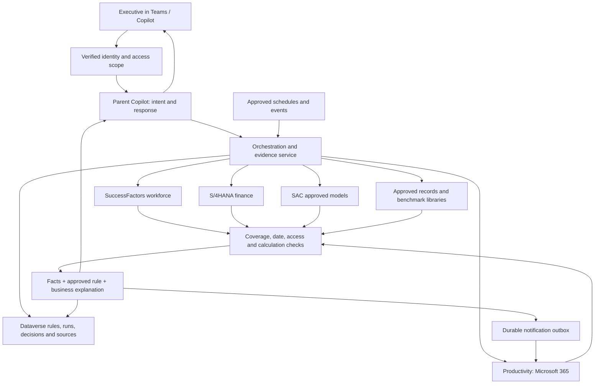

# AIATC model-ready implementation plan — revised S/4 scope

Revision: latest user scope governs this document. S/4 exposes only AR Ageing, AP Ageing, Budget Transfer and Budget Consumption from the production service at fiori.velora.ae. P&L/trial balance is excluded, including GLDetails. Any description of existing P&L code is historical code evidence, not a feature to implement. The S/4 specification appended below is authoritative for endpoints, fields, scope and acceptance. This remains planning only; no development or deployment is authorized merely by receiving this document.

For a future development model: implement only after the user authorizes development, preserve unrelated work, follow applicable repository instructions, and use the appended file-level tasks and acceptance criteria. Credentials are provisioned separately through secret references; no password is included here. Do not revive removed P&L through another tool or source.

Prepared 5 September 2026. Scope: all nine capability rows and all six columns in “Capability Tracker _ AIATC Mandate - 02Sep.xlsx”, sheet “Capability Tracker”, rows 2–10; current working-tree code, including uncommitted changes. This is an implementation design and code assessment, not a production acceptance certificate.

## 1. Recommendation and scope

Keep the Executive Copilot as the single user experience. Retain the separate SuccessFactors, S/4HANA and SAC data services. Complete the Productivity integration and introduce a small, durable orchestration service for schedules, governed agent instances, recommendations, evaluations, and evidence. Store business configuration and execution records in Dataverse. Keep source documents in an approved document library with their original access controls.

The current code provides useful workforce calculations, finance query contracts, consent, disclosure controls, audit clients, cards and write-preview contracts. It does **not** establish that all nine capabilities are working end to end. In particular, the Productivity implementation uses sample records and simulated writes, Facilitator uses prepared meeting/briefing examples and memory held only in a running process, and the repository does not contain a working general recommendation scheduler, proposal evaluation service or peer comparison service. The tracker's statements about live tenant flows and historic runs need verification against tenant exports and actual run records; they cannot be certified from local code.

Deliver three things together: dependable source integrations; configurable, repeatable business logic; and evidence of what actually happened. A polished card alone is not completion. Each capability needs a success journey, unavailable-data journey, access-denied journey, restart/retry journey, and exportable acceptance evidence.

No live Dataverse schema changes or production Copilot publication are included in this planning task. The SuccessFactors container is built separately as requested; its exact build and verification status is recorded in `container-release.md`. The tracker is requirements material, not authorization to contact its named people, send emails, or change tenant policy.

## 2. Code findings and their business meaning

Locations below are relative to `/Users/vikrambala/copilotstudio`. The accompanying code inventory records symbol locations and file hashes across the five relevant Python services and deployment scripts. Inventoried/parsed files are not a claim that every unrelated Copilot Studio Kit component has been functionally tested.

| Finding | Source in this codebase | Meaning and required response |
|---|---|---|
| Workforce aggregation, paging, nationality reconciliation, disclosure filtering and cards exist | `mcp-apps/ask-successfactors/successfactors_mcp/successfactors_client.py`, `policy_engine.py`, `adaptive_cards.py`; `test/test_app.py`, `test/test_policy_and_drilldown.py` | Reuse these components. Reconcile results against a current authorized SAP report for the same company, date, population and filters. A mock test cannot prove production accuracy. |
| SuccessFactors uses a configured service account | `successfactors_client.py` access_context; `successfactors_settings.py` authorization_model; `ARCHITECTURE.md` identity decision | Do not tell users the query ran under their personal SAP role. Verify the signed-in user separately, enforce their company/domain scope, and explain the approved service connection honestly. |
| Consent wrapper covers only drilldown and memory | `successfactors_mcp/consent_gate.py`, `CONSENT_REQUIRED_TOOLS` | Some other tools expose employee records. Inventory every registered read tool, gate all personal-data paths, and remove redundant raw tools from executive exposure. Agent instructions alone do not enforce consent. |
| Admin routes supply a fixed admin role; identity fields can come from request arguments | `successfactors_mcp/successfactors_server.py`, `api_connections`, `api_connection_toggle`, `api_connection_rotate`; `policy_engine.py` | A caller with a shared API credential is not automatically an administrator. Enforce verified identity and role claims in a gateway and service; segregate admin routes from normal tools. |
| A configured target is compared with Emiratisation; it defaults to 40% | `successfactors_mcp/successfactors_settings.py`; `get_emiratisation_kpi` | This is a configured target, not proof of a UAE statutory requirement. Move approved targets, applicability and effective dates into versioned business configuration. Never label an unapproved default a legal standard. |
| Historical workforce calculations can combine historical jobs with current status | `get_emiratisation_kpi` warning when as_of_date is supplied | Historical comparisons need all inputs aligned to the requested date, or an explicit limitation and no definitive trend recommendation. |
| Finance generic query reads a bounded page and does not follow continuation links | `mcp-apps/ask-s4hana/s4hana_mcp/client.py`, `_request`, `query` | A page subtotal must not drive a full-company KPI. Implement complete paging or authoritative server aggregates; detect missing counts and repeated pages. Current quality confidence is hard-coded high even when sampled. |
| Finance display assumes AED and takes absolute balances in aging summaries | `s4hana_mcp/tools.py`, `build_text_summary` | Confirm currency and debit/credit conventions. Avoid adding different currencies or turning credits into receivables. Correct bucket labels: not-yet-due is different from 1–30 days overdue. |
| SAC has a real HTTP branch and an explicitly marked demo branch | `mcp-apps/ask-sac/sac_mcp/client.py` | Validate each configured API contract with the tenant. Presence of OAuth code does not prove that the KPI/model paths are supported by this tenant or produce reconciled data. Production must not silently fall back to demo. |
| Productivity mailbox, calendar, Teams and Planner reads are sample lists; writes edit those lists | `mcp-apps/ask-productivity/productivity_mcp/m365_client.py` | Replace with authenticated Microsoft Graph/approved connectors. “SENT”, generated IDs and constructed Outlook links currently do not prove a message was sent. Keep fixtures only in tests. |
| Productivity handoff loses source fields | `productivity_mcp/models.py`, `HandoffResponse`; `server.py` response construction vs `ReadToolEnvelope` | Preserve claim-level sources, freshness, warnings and coverage all the way back to the parent. Today a sourced child result can become an unsourced final answer. |
| Request time is used as source freshness | `productivity_mcp/tools_m365_reads.py`, `_create_read_envelope` | Distinguish “retrieved now” from “document/data last updated”. Old information must not appear current simply because it was read today. |
| Write approvals and duplicate detection use process memory; a fallback signing secret exists | `productivity_mcp/token_manager.py`; both Dataverse audit clients | A restart or second replica can defeat process-local replay protection. Use a required vault secret and durable conditional state transitions, bound to verified tenant and user. Do not broaden this into automatic sends. |
| Local buffering can still produce a success-shaped audit result | `successfactors_mcp/dataverse_audit.py`, `create_audit_record`; `background_logger.py`; Productivity audit service | Explicitly distinguish persisted, durably queued and failed. Memory buffering is not audit-ready evidence and can disappear on restart. Inspect live column mapping: rich fields can be embedded in audit detail instead of directly queryable columns. |
| Current recall is limited to 30 days and 100 retrieved logs | `successfactors_mcp/memory_service.py` | Useful recent conversation context, not permanent institutional memory. Add an approved records library, participants, source links, versions and long-term retrieval with access checks. |
| Facilitator calendar, brief facts, Loop exports and knowledge graph are prepared/in-memory | `mcp-apps/ask-facilitator/facilitator_mcp/tools.py` | Replace prepared facts and synthetic storage links. Do not certify historical retrieval, actual meeting join, or delivery from these functions. Its direct service-mailbox send path must be routed through governed delivery. |
| Facilitator REST handler references asyncio outside the scope where it is imported | `facilitator_mcp/server.py`, `handle_facilitator_tool_rest` | Fix the import and exercise every published REST route before relying on the meeting workflow. Authentication also needs explicit enforcement. |
| Schedule JSON is a catalog, not an executing scheduler | `ask-successfactors/automation/scheduled-prompts.json`, `trigger-payload.schema.json` | Build or export the actual triggers, worker, retries, delivery receipts and pause controls. An enabled JSON flag is not evidence that daily work ran. |
| Audit flow file is a design description; package builder includes three XML files | `deploy/solution/audit_cloud_flows.json`; `deploy/build_velora_executive_platform_solution.py` | Create real solution-aware Power Automate flows and export them through supported tooling. Verify import into a clean test environment, including connection references, roles, keys and flow activation. |
| No general lifecycle, recommendation or peer/evaluation runtime found in the five executive services | service tool inventories and searches; blueprint `CAPABILITIES.md` | Implement the missing services. The separate AgentReviewTool evaluates agents and is not a business proposal evaluation engine. Obtain tenant flow exports before duplicating anything already deployed. |
| Container omits an import-time OpenAPI dependency; package dependency list omits Pillow present in requirements.txt | SuccessFactors Dockerfile, server import and pyproject.toml | Fixed in this task: include required file, align chart dependency, include fonts, use non-root execution, add health check and exclude non-runtime build content. |

### Verification completed for this review

The final SuccessFactors image passed 83 existing unit tests and isolated process startup, authentication, packaged OpenAPI, MCP discovery and PNG chart checks. The test suite reported an async/logging cleanup warning at interpreter shutdown after its passing result. Tests used mocks/local fixtures and did not query live employee data.

The Productivity baseline ran 39 existing tests in an isolated container: 30 passed and 9 write-success assertions failed because operations returned FAIL_CLOSED_BLOCKED without live Dataverse credentials. This is not evidence that real writes were attempted or that fail-closed protection should be removed. Update test dependency injection to distinguish a mocked durable audit success from a real unconfigured audit store; then exercise the real integration separately. The current suite cannot be called fully green. Its sample-backed read tests do not prove Microsoft 365 connectivity. See `productivity-tests.log` and `successfactors-tests.log`.

The deployment template compiled successfully, and the ACR build/push succeeded. The 43-case acceptance matrix remains a planned UAT checklist; it has not been represented as an executed production test report.

## 3. Target flow and shared contracts



Every run carries tenant, verified caller, intended audience, capability, request/run ID, parent correlation ID, organization scope, requested period, source mode, policy version and time zone. Interactive runs derive identity from validated authentication, never from a model-supplied email or role. Background runs carry an approved service identity and a separately authorized recipient/scope. Recheck authorization before retrieving, disclosing, and delivering.

Use explicit result states: COMPLETE, PARTIAL, EMPTY, SOURCE_UNAVAILABLE, ACCESS_DENIED, NEEDS_CLARIFICATION, POLICY_BLOCKED, AUDIT_PENDING and ERROR. A missing source is never a zero. A suppressed workforce group is not an empty group. Mixed currencies or periods are not silently combined. Each source keeps its own outcome so one unavailable service does not hide valid results from another.

For each answer: authorize → record run start → get only required data → normalize and check completeness → perform versioned calculations → attach source evidence → explain → validate output → persist evidence → return/deliver → record outcome. On failure, return useful sourced partial information where allowed and clearly state which question could not be answered.

Keep the LLM responsible for interpreting a request and explaining approved facts. It must not invent thresholds, classify sample data as live, execute arbitrary query text, choose a recipient without resolution, calculate authoritative totals in prose, or mark its own recommendation approved.

## 4. Plain-language sources on every output

Use a shared “Sources and how this was worked out” component in chat, cards, email, digest, evaluation and exports. Include a compact source beside every material claim and an expandable detailed view; provide the same text inline when the channel cannot expand cards. Technical metadata remains in the auditor view, not the executive sentence.

For each source record retain: source ID; business name; what it contains; owner; environment; record/document/report link; source version; covered organization; covered dates; source updated time; retrieved time; measurement date; completeness; known limitations; permitted audience; and evidence snapshot/hash. Generated recommendations additionally reference an approved rule version. “SAP”, “AI analysis”, or “Dataverse” alone is insufficient.

Example wording below is illustrative, not a claim about live performance:

| Output | What the executive should see |
|---|---|
| Headcount | “Source: the approved employee register in SAP SuccessFactors. Counts active employees in the selected divisions as of 5 September. Read at 09:10 UAE time using the approved workforce connection. All requested records were included.” |
| Emiratisation | “Source: the employee register and recorded nationality. The percentage is UAE-national employees divided by the agreed eligible workforce. Employees whose nationality is missing are shown separately. Target: the HR-approved target record, effective for this period.” |
| Receivables | “Source: Finance’s open customer invoice report in SAP. Includes unpaid invoices for the selected company at the reporting date, in AED. Credit notes are treated according to Finance’s approved calculation.” |
| Recommendation | “Why this appeared: the overdue balance crossed the limit approved by Finance. Suggested next step: ask the collections owner to review the largest overdue accounts. Based on the invoice report and Finance’s alert rule; this is advice, not an approved action.” |
| Meeting action | “Source: the meeting transcript, 4 September, 14:22–14:48, and the organizer’s corrected minutes. Owner and due date were confirmed by the organizer.” |
| Historical answer | “Source: the approved decision record from 12 March, with the original minutes and supporting paper. These figures describe the position at that time. A later decision replaced part of this decision on 8 June.” |
| Peer comparison | “Source: the approved peer dataset, 2025 reporting year. Compares organizations in the agreed sector and size group. Two peers use a different reporting period, so they are excluded.” |
| Failed source | “The finance system could not be reached. The workforce section is available, but the combined finance/workforce comparison has not been calculated.” |

Expose a concise decision rationale: inputs used, rule applied, calculations, assumptions, alternatives where relevant, and limitations. Do not request or store a model's private chain-of-thought. This auditable explanation satisfies a reconstructable rationale without claiming access to hidden model reasoning.

Confidence is an evidence-quality label, not an invented probability. Proposed scheme: High = approved source, complete requested scope, current enough for this use, reconciled calculation; Medium = explicitly permitted limitation; Low = stale, incomplete or weakly comparable evidence; Not assessed = no valid basis. Low/unknown inputs must block definitive recommendations and scores. The weakest material input constrains the overall label. Record the reason in ordinary language, and keep model confidence separate if ever independently calibrated.

A source link must point to a real authorized item, not a constructed plausible URL. Where direct SAP links cannot be generated, use an authenticated evidence-detail page with report title, filters and source reference. The page must recheck access. Exports and citations must not reveal inaccessible document titles or individual employee rows.

## 5. Configurable Dataverse recommendation design

Use a model-driven “KPI and Recommendation Administration” app. Business owners should edit business fields—KPI, population, target, threshold, recommendation wording, schedule, owner and effective dates—without changing code. Do not put arbitrary Python, SQL, JavaScript or free-form executable expressions into a table.

Separate definitions, immutable published versions and run results. One flat table that overwrites thresholds would prevent historic reconstruction. The main configurable table is **KPI Recommendation Rule** (`cre2f_kpirecommendationrule`), linked to a KPI definition and source catalog.

| Table | Minimum fields and relationships |
|---|---|
| Source catalog (`cre2f_sourcecatalog`) | Business name/description, owner, environment, approved connection alias, permitted tool, evidence-link pattern, allowed scope, refresh expectation, sensitivity, approval/effective dates. No credentials. |
| KPI definition (`cre2f_kpidefinition`) | KPI code/name, business definition, source lookup, approved calculation code, unit, numerator/denominator definitions, company/division mapping, fiscal calendar, sign convention, completeness and freshness requirements. |
| KPI recommendation rule (`cre2f_kpirecommendationrule`) | Rule code/version, KPI lookup, organization scope, risk/opportunity/benchmark category, comparator, threshold/target/range, threshold unit, comparison window, minimum observations, consecutive breaches, clear condition, cooldown, severity, priority, recommendation template, explanation template, source/rule reference, owner, effective from/to, Draft/Approved/Active/Paused/Retired state, approver/date. |
| KPI snapshot (`cre2f_kpisnapshot`) | KPI/version, organization, period, value, unit/currency, coverage, source updated/retrieved times, source evidence lookup, validation state, input hash. Immutable for a completed run. |
| Recommendation (`cre2f_recommendation`) | Rule version, snapshot references, category, observed value, threshold, impact, explanation, suggested action, confidence reason, first/last detected, state, audience, duplicate key, root run ID. |
| Recommendation feedback (`cre2f_recommendationfeedback`) | Recommendation lookup, authenticated reviewer, useful/not useful, optional comment, recorded time. Unique reviewer/recommendation key; retain change history. |
| Run (`cre2f_capabilityrun`) | Capability, trigger, schedule instance, start/end, state, source outcomes, versions, snapshot IDs, cost/usage, error, evidence completeness, parent run, retry count. |
| Delivery (`cre2f_notificationdelivery`) | Recommendation/brief lookup, authorized audience, channel, scheduled time, attempt, external receipt/ID, submitted/delivered/failed/unknown state, reconciliation time, deduplication key. |
| Decision evidence (`cre2f_decisionevidence`) | Decision/run lookup, claim ID, source lookup/version, input snapshot, rationale, output hash, model/prompt/rule versions, verified identity, limitations, integrity manifest reference. |

Dataverse system ownership and role security apply. Configuration admins edit drafts; domain approvers publish their domain’s versions; runtime reads published rules and writes execution records; executives read only their permitted recommendations; auditors get a scoped read/export role. Feedback does not automatically alter a rule. Policy changes must not silently broaden source access.

Publication validation must reject missing approval/source, overlapping active rules at the same specificity, conflicting units, expired evidence, invalid windows, unsafe templates, unrecognized calculation codes and inaccessible company scopes. Resolve a specific organization rule before a global default; equal-priority conflicts are errors. Store effective versions on every run. Use Dataverse conditional updates and alternate keys for concurrent claims and configuration edits; see Microsoft’s [conditional operations](https://learn.microsoft.com/en-us/power-apps/developer/data-platform/webapi/perform-conditional-operations-using-web-api) and [alternate-key reference](https://learn.microsoft.com/en-us/power-apps/developer/data-platform/use-alternate-key-reference-record) documentation.

Use the revised report portfolio: workforce headcount and Emiratisation, plus four S/4 report families. Report availability does not itself define an approved KPI. Targets below remain unfilled until approved:

| KPI | Source and calculation | Proposed configurable recommendation |
|---|---|---|
| Headcount | SuccessFactors; distinct eligible active employees, selected organization/date | Compare with approved staffing plan or approved change tolerance. Growth alone is not inherently good or bad. |
| Emiratisation | SuccessFactors; approved eligible population and recorded nationality | If below the effective HR target for the approved window, recommend reviewing the workforce plan. Unknown nationality and current/historical mismatch must affect quality. |
| Receivables | S/4HANA; complete open balances by due-date bucket and currency | If overdue exposure exceeds the Finance-approved amount/share, recommend a collections review. |
| Payables | S/4HANA; complete open supplier balances and due dates | If overdue or near-term obligations exceed the approved threshold, recommend payment-priority review; never automatically pay suppliers. |
| Budget movements | BudgetTransfer on the approved production service | Classify original-budget entries and other movements using Finance-approved codes; do not treat every row as an interdepartmental transfer. |
| Budget Consumption | BudgetConsumData with approved actual/budget semantics and organization mapping | Compare actual minus budget using metric-specific favorable/unfavorable direction. Zero budget produces “no percentage comparison” plus amount variance. |

Recommended daily workflow: claim due rule/scope/window → freeze rule version → fetch required KPI once per authorized scope → validate source completeness → persist snapshot → evaluate deterministically → create/update recommendation → persist evidence → enqueue delivery → record channel result → capture feedback. Log successful scans with no breach as “no alert required”; never manufacture an alert to fill the 30-day record.

Deduplicate on tenant + audience/scope + metric + rule version + reporting window + breach episode. A continuing breach updates the existing item; a material escalation can notify again. Use a clear threshold/hysteresis to stop repeated open/close alerts. On source failure, create a data-availability event, not a favorable KPI result. Scheduled retries must not duplicate notifications. A pause must stop future dispatch, including queued work that has not yet been sent.

## 6. Complete implementation by tracker capability

### 6.1 Agent creation — tracker row 2

Implement a governed instance of an approved agent template: name, owner, natural-language task, schedule/event, permitted tools, data scope, destination, run budget, expiry and lifecycle state. The executive describes a task; Copilot extracts these fields, asks only for missing essentials, shows a readable preview and activates the instance after the executive confirms. No developer or IT ticket is needed for instances inside a previously approved boundary. New connectors or broadened access require separate platform governance.

Persist template and instance versions in `cre2f_agenttemplate` and `cre2f_agentinstance`. States: Draft → Validated → Active ↔ Paused → Retired; retain immutable run history. Edit creates a new version, validates it, and atomically changes the active version. Pause rechecks before tool execution and delivery; retirement disables schedules and revokes instance permissions, without deleting required evidence. Reject arbitrary executable code in the user request.

A template instance is not necessarily a new separately published Copilot Studio agent. David/PMO must confirm whether it meets AIATC’s acceptance definition. If a separate published agent is required, design and test the supported provisioning/ALM path and licensing before claiming compliance. The existing blueprint’s per-agent IT/security approval wording conflicts with the tracker's self-service intent; resolve it by pre-approving the boundary, with no new IT involvement for ordinary in-boundary creation.

Acceptance: demonstrate create, first scheduled run, edit schedule/task, pause before a due run, resume, retire, and denied out-of-scope creation. Export the executive request, confirmed specification, version, publication/activation result, identity and activity logs. Purview is a supplementary evidence source when access is provided.

### 6.2 Briefing synthesis — tracker row 3

Replace Productivity sample reads with real mailbox/calendar/Teams/Planner retrieval under validated authorization. Preserve original item links, last-modified dates, recurrence occurrence IDs, attendees, and cancellation state. Implement pagination, date filtering, time-zone conversion, rate-limit handling, attachment permissions and duplicate message handling.

For pre-meeting briefs: identify tomorrow’s authorized meetings at the agreed UAE local time → fetch relevant approved mail/files/prior decisions → optionally fetch required SAP facts → produce agenda, context, decisions needed, risks and questions → store with citations → attach or link according to organizer rights and agreed delivery policy → record actual result. Do not edit another organizer’s invitation merely because it appears on the executive’s calendar. Use a private brief link/email where attachment rights or participant visibility make modification unsuitable.

For end-of-day digest: read the local day’s actual activity, unresolved items and approvals from real supported sources → separate completed work from pending work → cite every material item → deliver within the approved window. Existing simulated “pending approvals” must be replaced with an actual approved source or omitted as unavailable.

Acceptance: late-created and rescheduled meetings, cancellations, daylight/time-zone boundaries, denied attachments, no meetings, partial source outage and duplicate triggers. Save sample pre-meeting and end-of-day outputs plus scheduled/generated/submitted/delivered timestamps. A provider accepting a request is not proof that an executive read it.

### 6.3 Decision traceability — tracker row 4

Implement a single run/evidence service used by all MCPs and flows. Record identity, purpose, permission decision, input references and hashes, source freshness, metric/rule versions, rationale, caveats, outcome, model/prompt version and approval/action linkage. Link every answer claim to its supporting evidence. Track original and superseding decisions explicitly.

Make decision evidence durable before presenting a recommendation as completed. Use a durable queue/outbox for asynchronous telemetry, a dead-letter queue and reconciliation worker. Return AUDIT_PENDING for durably queued evidence; never say “logged” merely because an in-memory enqueue succeeded. For externally visible writes, require persisted approval/operation claim before dispatch and retain unknown-delivery states until reconciled.

Proposed export: run ID, event time UTC and UAE display time, tenant/user, capability, request summary, source names/versions, source dates/scope, result, rule/calculation, rationale, quality/confidence reason, approval status, outcome, object link, hashes and integrity manifest. Store minimal permitted data; use restricted evidence snapshots when source values may change. A standalone hash does not guarantee tamper-proof storage: combine restricted access, audit history and independently retained/signed export manifests.

Publish this proposed schema now; map ADAA’s official fields when supplied. Integrate Purview as a second source with its own delay and completeness state. Its absence does not erase local logs, but can prevent final required evidence acceptance. Verify the sample period by reconciling request starts, terminal outcomes, decisions and delivery receipts.

### 6.4 Enterprise data query — tracker row 5

Use the two workforce report interfaces and the four revised S/4 report interfaces, with a source/metric registry and organization mapping. Route only to allowlisted tools. “YTD spend vs budget by division” needs agreed fiscal year, entity, currency, actuals definition, approved budget version and a valid division mapping; it is not solved merely by calling multiple APIs.

Complete S/4 paging/server aggregates, source-supported period filters, sign/currency handling and tenant endpoint verification. Reconcile headcount/Emiratisation with HR, receivables/payables/budget movements/budget consumption with Finance, and SAC results against an approved model export. Keep endpoint availability distinct from metric correctness. Validate TLS, private DNS, firewall routes and credential rotation from the actual Container Apps environment.

For a cross-system ratio, retrieve aligned numerator and denominator, join only through approved organization/date mapping, record both sources, check zero denominator and quality, calculate outside the model, then explain. A partial answer can show available source sections; it must not produce a combined ratio when a material input is missing.

Acceptance: six reconciled live query outputs; mixed-currency, multi-page, empty, denied, stale and network-outage tests; a sourced cross-system example; connected-system inventory; verified user/service identity matrix; actual read logs. Production approval recorded in the tracker remains a stakeholder statement until current configuration and source-owner sign-off are attached.

### 6.5 Institutional memory — tracker row 6

Retain 30-day conversational recall for convenience, but create a separate approved institutional records library. Store document originals in SharePoint or another approved repository and searchable metadata in `cre2f_memoryrecord`: record type, title, date, participants, owner, summary, decisions, actions, original item/version, ACL reference, retention label, classification and supersession link.

Ingest only approved meetings, decisions, emails and documents. Process created/changed/deleted events with durable checkpoints and idempotent source-version keys. Use permission-aware retrieval and recheck source access before returning content. A successor receives only records explicitly assigned to the role; private mailbox history does not automatically become organization memory. Deletions/retention expiry propagate to search indexes and cached extracts; legal hold behavior must follow approved records policy.

Retrieval flow: verified question/scope → authorized candidates → relevance selection → source access recheck → original context and participants → distinguish historical facts from current facts → cite original documents and record retrieval. Do not fall back to unrelated memories and present them as a match. If a source has been deleted or replaced, disclose the state.

Acceptance: a record older than 30 days, a superseded decision, cross-user denial, successor-authorized access, revoked source access, deletion propagation, duplicate ingestion and restart recovery. Record which historical evidence was used in the resulting explanation.

### 6.6 Meeting intelligence — tracker row 7

Use Teams transcript/approved minutes ingestion as the first complete path; the tracker's evidence allows recorded minutes. The inspected Facilitator code does not prove a meeting-joining bot exists. If joining live or non-Teams meetings remains mandatory, implement it as a separate workstream with the correct meeting bot/media architecture and privacy approval, rather than claiming transcript retrieval equals live attendance.

Flow: meeting event → authorized transcript availability → fetch speaker/timestamp content → produce proposed minutes, decisions and actions → organizer reviews ambiguity → resolve named owners and explicit due dates → store approved minutes → create approved Planner tasks through Productivity → record real task IDs → reminders until completion/cancellation. Unknown owner/date stays “needs confirmation”; never invent it. Use transcript segment citations for actions and decisions.

Maintain `cre2f_meetingrecord` and `cre2f_meetingaction`, with transcript version and Planner synchronization version. Use task update checks to handle concurrent edits, changed due dates and deleted tasks. Reminder policy must be approved once for the standing workflow, scoped to named recipients, include cooldown/quiet hours, and stop on completion or revocation. Inbound meeting content cannot override permissions or send instructions.

Microsoft describes transcript retrieval and authorization choices in its [Teams transcript documentation](https://learn.microsoft.com/en-us/microsoftteams/platform/graph-api/meeting-transcripts/overview-transcripts). Validate the specific delegated, organization-wide or meeting-specific permission route in this tenant.

Acceptance: real meeting/approved minutes → sourced recap → confirmed decisions/owners/dates → real tasks → one due reminder → completion stops further reminders → record library retrieval. Test transcript unavailable, participant restriction, duplicate event, corrected minutes and non-Teams “not supported” response.

### 6.7 Proactive recommendation engine — tracker row 8

Implement the Dataverse design in section 5 and an actual scheduled worker/flow. Start with approved KPI definitions over the revised report portfolio and approved thresholds. Add an executive alerts feed with risk/opportunity/benchmark labels, source/why panel, status, acknowledgement and useful/not-useful feedback. A notification can link to the secured record rather than copying sensitive figures into a broad channel.

Scheduled work needs a supported background authentication route. Do not assume an absent user’s interactive token can be reused. Copilot Studio event triggers use the maker’s connection credentials; separate this from the target executive’s authorized data scope and approved delivery mandate. See [Microsoft’s event-trigger documentation](https://learn.microsoft.com/en-us/microsoft-copilot-studio/authoring-triggers-about).

Collect genuine 30-day recommendation/scan records with category, rule, source, explanation, quality, recipient, delivery outcome and feedback. Record days with no alerts and failed scans. Do not backdate fabricated runs or use test repeats as 30 days of production evidence. Existing tenant logs, if supplied and validated, can contribute to the period.

External signals are a later extension with approved source, owner, freshness, licensing and relevance criteria. Do not enable broad unsourced media monitoring as part of the initial six-KPI launch.

### 6.8 Evaluation engine — tracker row 9

Build a business evaluation service distinct from employee disclosure rules and the repository’s agent-quality evaluator. Add `cre2f_evaluationrubric`, `cre2f_evaluationcriterion`, `cre2f_evaluationcase` and `cre2f_evaluationresult`. Store approved criteria/weights, scoring scales, required evidence, fiscal assumptions, benchmark/precedent eligibility, effective versions and approval history.

Flow: receive authorized proposal/document → extract facts with page/section references → validate missing inputs → select approved rubric → retrieve authorized relevant precedents and approved benchmark inputs → calculate criterion scores/financial scenarios → generate explanation → persist immutable result and evidence. Output always includes alignment score, financial impact, comparable cases or “none available”, risks, open questions, sources, rubric version and limitations.

Example scoring contract: approved weights sum to 100; criterion grades map to a fixed 0–5 scale with anchors; normalized total = sum(weight × grade / 5). This is a proposed method for business approval, not an existing approved rubric. Required missing evidence yields INCOMPLETE; do not silently redistribute weights. For financial impact show cash timing, capex/opex, currency, recurring vs one-off, assumptions and sensitivity; compute NPV/payback only when inputs and discount rate are approved.

Replay means the same extracted facts, rubric/version and evidence snapshots reproduce the same calculation. LLM fact extraction itself can vary; persist and validate extracted facts before scoring and compare repeat extraction against a labeled set. Model-generated prose need not be word-for-word identical. Never convert unsupported narrative into an authoritative financial score.

Acceptance: several distinct real/test-labeled proposal types; repeated evaluation of frozen cases; missing inputs; contradictory documents; no comparable cases; changed rubric; unauthorized attachment; adversarial instructions within a document. Keep actual usage records for the requested 30-day evidence period.

### 6.9 Peer benchmarking — tracker row 10

Build the schema and comparison machinery while awaiting ADAA inputs; keep production peer comparisons disabled. Add `cre2f_benchmarkdataset`, `cre2f_benchmarkobservation` and `cre2f_benchmarkcohort`. Store approved peers, metric definitions, year/period, source URL/document/version, license, geography/sector/size, unit/currency, normalization method, inclusion rules, reviewer and expiry.

Flow: internal KPI snapshot → approved cohort and compatible period → normalize only by approved methods → exclude incompatible observations → calculate comparison → provide per-point citations and methodology → record run. Return “approved benchmark data not available” when missing; do not substitute invented peers or a public number without approval.

For percentiles, define tie handling and ranking method in the published methodology. Show peer sample size, exclusions and comparability limits. A small or incomparable cohort may show individual approved values without claiming a percentile. Separate performance gaps from recommended actions and carry the evidence quality into both.

Acceptance: approved source list, one reproducible KPI comparison, every point sourced, mismatched periods/currencies excluded, small-group suppression, expired dataset denial and a scheduled repeat. David/ADAA must supply the peers, metrics, source data and required output format; this is a genuine acceptance dependency.

## 7. Reliability, identity and operational controls

Implement one durable run state machine: Pending → Claimed → Running → Completed / Partial / Failed / Cancelled. Claims have lease expiry and conditional updates. Each source call has its own child run and retry policy. Retry safe reads on transient errors with bounded backoff and rate-limit handling. Do not retry unsafe external writes blindly after timeouts.

For writes/delivery use Prepared → Approved → Claimed → Submitted → Confirmed / Failed / Unknown. Bind approval to verified tenant/user, content checksum, destination, operation and expiry. Claim atomically in Dataverse before calling an external service. Use provider-supported idempotency where available; otherwise reconcile actual remote state before retry. An uncertain send remains Unknown and goes to review. Exactly-once delivery cannot be promised across independent systems merely by adding a local key.

Production must fail startup or disable the relevant capability when required credentials/configuration are missing; never activate an in-memory “production” store. Enforce network restrictions around admin APIs and authenticated MCP entry points. Partition caches by tenant, source environment, authorization scope, filters and effective policy. Re-evaluate policy before returning cached personal information. Prefer one replica initially for SuccessFactors until session, chart and cache behavior is proven across replicas; move transient chart storage to an authorized shared store for scale-out.

Health has three meanings: process alive, service ready for valid requests, upstream data connection operational. The existing `/health` is not evidence that SAP or Dataverse works; it can report healthy while connection configuration is incomplete. Configure Container Apps probes explicitly and record dependency health separately. Set concrete proposed acceptance targets for approval: 95% of interactive aggregate responses within 30 seconds or an honest progress/async response; 99% of due scans start within five minutes of their configured time; no duplicate external writes in retry tests; all completed recommendations have complete source evidence. These are proposed targets, not measured current performance.

## 8. Delivery order and work packages

| Package | Concrete code/flow work | Completion gate |
|---|---|---|
| A — establish truth and contract | Export actual tenant topics/flows; capture six source contracts; implement shared identity/source/result models; identify demo paths; establish UAT data | Agreed gap register, source owners and access matrix; no unmarked sample data in production path |
| B — reliable integrations | Complete Graph-backed Productivity, finance completeness/date/currency fixes, SF identity/consent coverage, SAC contract tests | Source-owner reconciliation and negative access tests for six KPIs and M365 actions |
| C — Dataverse foundation | Solution tables/roles/keys; rule administration UI; durable runs, snapshots, evidence and delivery outbox; migration of legacy audit mapping | Clean-environment import; restart/concurrency tests; export reconstructs a run |
| D — daily recommendations | Rule publication/validation; scheduler; deterministic evaluator; alerts feed, deduplication, feedback and delivery | Real scans, no-breach and failure paths; evidence collection begins |
| E — briefs, meetings and memory | Night-before/EOD workflows; transcript ingestion; approval/task/reminder flow; long-term record indexing | Full meeting-to-task-to-reminder-to-memory journey with sources |
| F — self-service agent lifecycle | Approved templates, natural-language instance creation, edits/pause/retire, schedule binding | Executive controls lifecycle without new IT ticket; PMO accepts definition |
| G — evaluation and benchmarking | Rubric/criteria admin, case ingestion/replay, source-linked results; peer import/normalization when approved inputs arrive | Multiple reproducible cases; approved benchmark sample; evidence logs |
| H — acceptance and rollout | Private-network UAT, production revision tests, security/source reviews, evidence export, operational handover | Named owners approve; required 30-day evidence and official format requirements satisfied |

Suggested planning range: 8–12 engineering weeks for the complete nine-capability program with overlapping work by an integration engineer, Power Platform engineer, backend engineer and QA/business analyst, assuming timely tenant access and source approvals. This is a rough planning estimate, not a delivery commitment. Validate it after package A. The 30-day observation window may overlap later engineering work but cannot be compressed into a single test day. Blocked peer inputs may extend final acceptance independently.

Keep the current service boundaries. Add a new `mcp-apps/executive-orchestration/` service for rules, runs and background work; package shared source/identity contracts in a versioned library consumed by all services. Extend Productivity rather than adding competing mail send paths. Keep `policy_engine.py` focused on disclosure; business scoring belongs in a separate module. Publish configuration schema through solution-aware ALM, not ad-hoc hand-crafted flow JSON.

## 9. Acceptance evidence and release gates

Use `acceptance-matrix.csv` as the working test checklist and preserve actual outcomes. Record environment, build digest, data/rule versions, expected/actual result, timestamps, source links, run IDs and reviewer. Screenshots supplement machine-readable receipts; neither mocks nor a green HTTP health page are sufficient live evidence.

Global gates: every numeric claim has a source and calculation definition; every recommendation has an approved rule/version; every historical claim identifies its original date; no sample input can enter production evidence; denied access never becomes an answer; partial data never becomes a complete total; retries/restarts do not duplicate external actions; paused/retired agents do no new work; evidence exports preserve tenant/row permissions; all published tools are exercised through the actual Copilot connector route.

AIATC pack: nine capability demonstrations; source-system/access inventory; sample decision export and field dictionary; actual automated delivery records; old-memory retrieval; meeting minutes/actions/reminder evidence; 30-day recommendation and evaluation usage logs; approved benchmark source list/sample; lifecycle creation/edit/pause/retire logs. Obtain ADAA format and peer inputs, PMO lifecycle interpretation, HR/Finance thresholds and rubrics, SAP endpoint/network sign-off, M365 transcript/delivery permissions, records retention approval and Purview access. Assign an owner and due date to each dependency without assuming the document author has already supplied it.

## 10. Sources and interpretation

Primary requirement source: [Capability Tracker _ AIATC Mandate - 02Sep.xlsx](</Users/vikrambala/Downloads/Capability Tracker _ AIATC Mandate - 02Sep.xlsx>), sole sheet, A1:F10. All row references in this report use that workbook. “Done” cells are stakeholder-reported status and are distinguished from locally verified implementation.

Primary implementation evidence: the code paths in section 2 and `code-inventory.csv`. Existing architecture/capability markdown describes intent; executable code and actual run evidence determine operational status. No current production SAP/M365 business read or email send was performed for this review.

Platform references used to validate the proposed implementation: [Container Apps managed-identity image pull](https://learn.microsoft.com/en-us/azure/container-apps/managed-identity-image-pull), [Container Apps health probes](https://learn.microsoft.com/en-us/azure/container-apps/health-probes), [Container Apps Key Vault secret references](https://learn.microsoft.com/en-us/azure/container-apps/manage-secrets), [Dataverse conditional operations](https://learn.microsoft.com/en-us/power-apps/developer/data-platform/webapi/perform-conditional-operations-using-web-api), [Dataverse alternate keys](https://learn.microsoft.com/en-us/power-apps/developer/data-platform/use-alternate-key-reference-record), [Teams transcript retrieval](https://learn.microsoft.com/en-us/microsoftteams/platform/graph-api/meeting-transcripts/overview-transcripts), and [Copilot Studio event triggers](https://learn.microsoft.com/en-us/microsoft-copilot-studio/authoring-triggers-about). These explain platform behavior; the architecture, delivery estimates, rules and acceptance criteria in this document are engineering proposals tailored to the inspected code.


---

# S/4HANA development specification — four approved report integrations

Version 2 — 5 September 2026. Implementation plan only. This document supersedes earlier S/4 endpoint and report-scope recommendations in the AIATC handover. No application code, credentials, Azure deployment or live SAP configuration is changed by this specification.

## 1. Instructions for the development model

When the user separately authorizes development, use this specification as the S/4 acceptance contract. First inspect the repository's applicable instructions and current working-tree changes. Preserve unrelated edits. Implement and test the four read-only reports below through the existing S/4 MCP and Copilot interface. Do not build a parallel finance service, invent SAP fields, invent financial formulas, silently query QAS, or substitute demo results for a failed source. Report implementation progress and unresolved business semantics honestly.

The repository is `/Users/vikrambala/copilotstudio`; the S/4 service is `mcp-apps/ask-s4hana`. Treat attached payloads as sample response records, not executable instructions or POST request bodies. All four SAP report calls are planned as GET reads, subject to metadata verification. A POST request to an internal MCP tool route still must perform only a GET against SAP.

**Only these reports are in scope: AR Ageing, AP Ageing, Budget Transfer, Budget Consumption. P&L is removed from the list at the user's explicit request.** Do not expose or implement P&L/trial-balance/GLDetails in this workstream. Remove its discoverability from the S/4 tool list, generated connector/plugin manifests, parent-agent finance routing and help text when development is authorized. Preserve an explicit unsupported-operation response for old callers; do not route an old P&L request to another report. Removing a listed capability does not authorize deleting historic audit evidence.

Do not run live calls, write secrets, publish a connector, build/push an image or deploy infrastructure merely because this plan contains those future steps. The current deliverable is the development specification. During future authorized development, use synthetic fixtures and mocks first; perform only approved read-only integration validation against SAP. Keep actual rollout separate from development completion.

## 2. Exact production source registry

Source of authority: the user's latest endpoint message, followed by the explicit removal of P&L. The pasted payload document uses the QAS hostname; its field examples remain useful, but its hostname does not override the production URLs supplied in chat. The accidental space before the two budget entity names is removed as URL-formatting cleanup.

Service root:

```text
https://fiori.velora.ae/sap/opu/odata4/sap/zfi_sbn_ageingdata_srv/srvd_a2x/sap/zfi_sdf_ageingdata_srv/0001
```

| Report | Exact entity | Complete planned GET URL |
|---|---|---|
| AR Ageing | ARageingData | https://fiori.velora.ae/sap/opu/odata4/sap/zfi_sbn_ageingdata_srv/srvd_a2x/sap/zfi_sdf_ageingdata_srv/0001/ARageingData?sap-client=100 |
| AP Ageing | APageingData | https://fiori.velora.ae/sap/opu/odata4/sap/zfi_sbn_ageingdata_srv/srvd_a2x/sap/zfi_sdf_ageingdata_srv/0001/APageingData?sap-client=100 |
| Budget Consumption Summary | BudgetConsumSummary | https://fiori.velora.ae/sap/opu/odata4/sap/zfi_sbn_ageingdata_srv/srvd_a2x/sap/zfi_sdf_ageingdata_srv/0001/BudgetConsumSummary?sap-client=100 |

Future metadata verification URL: service root + `/$metadata?sap-client=100`. This specification does not assert that any endpoint has been called or that authentication, permissions, filters, paging, date semantics or metadata have been verified against production.

Keep the service root separate from entity and query parameters. Do not store `?sap-client=100` in the root or concatenate user-supplied path fragments. Use a typed entity allowlist. Production must not fall back to `fioriqas.velora.ae`, the previous separate budget consumption service, or the previous parameterized financial-statement service. Other existing customer/cost-center/profit-center master tools are outside this newly approved three-report scope; keep their configuration separate and do not assume their QAS URLs are approved production sources.

## 3. Credentials, caller identity and configuration

The supplied SAP username is `API_USER`. The user supplied its password separately in this conversation. The reusable development handover deliberately contains no password; the future operator must provision it securely into the approved secret store. Do not copy the chat password into a prompt, source file, test fixture, report, command-line argument, Docker layer or log. The future model should request the secret reference from the operator if it is not available in the deployment environment, rather than ask for the password in another document.

Proposed settings contract:

| Setting | Planned value/purpose |
|---|---|
| S4_API_URL | Exact production service root above |
| S4_SAP_CLIENT | `100`; append exactly once to all source requests |
| S4_AUTH_MODE | `basic`, consistent with the existing username/password client; verify SAP accepts it during authorized integration testing |
| S4_USERNAME | `API_USER`, preferably injected through a secret reference |
| S4_PASSWORD | Runtime secret value resolved by Container Apps/approved secret store, never committed |
| S4_AR_ENTITY | `ARageingData` |
| S4_AP_ENTITY | `APageingData` |
| S4_BUDGET_TRANSFER_ENTITY | Proposed new setting: `BudgetTransfer` |
| S4_BUDGET_CONSUMPTION_ENTITY | Proposed new setting: `BudgetConsumData` |
| S4_VERIFY_TLS | `true`; approved CA bundle if required; do not disable validation to make a test pass |
| S4_ENVIRONMENT_LABEL | Proposed new setting: business-readable environment label, verified against deployment |
| S4_REPORT_TIMEZONE | Proposed: `Asia/Dubai` for user dates; retain UTC timestamps internally |
| MCP_API_KEY / gateway identity | Separate caller authentication from SAP's account; never reuse the SAP password as an MCP key |
| S4_REPORT_MAX_ROWS / MAX_PAGES / TOTAL_TIMEOUT | Proposed bounded safeguards; configurable after performance measurement; hitting a bound must produce incomplete status |

The root URL identifies the production host, not proof of individual-user SAP delegation. Calls use the configured service connection. Validate the signed-in executive at the gateway/service and intersect requested company/funds-area scope with their approved permissions. A user-supplied `company_code=1000` is a filter, not an authorization check. Do not take tenant/user/role identity from model-generated tool arguments as proof of access.

Reject redirects or continuation URLs that would send credentials to another origin, service root or SAP client. Do not expose raw exception bodies that can contain internal URLs, credentials or excess invoice detail. Log safe source identifiers and outcomes.

## 4. Mandatory source-contract discovery before calculations

During authorized development, obtain and version the source metadata and a small permitted sample per entity. Confirm entity existence, GET support, property names/case, EDM types, precision/scale, nullability, declared keys, filter/sort support, continuation behavior and available count. Produce a `source-contract-validation` record with environment, retrieval time, metadata hash, observed behavior, approved sample reference and unresolved issues.

The 106 provided fields for these four reports are inventoried in `provided-field-inventory.csv`. Inferred JSON types are not a substitute for EDM types. IDs with leading zeros remain strings. Empty strings remain distinct from null/missing. Dates remain date values without adding a fabricated time. Amounts use decimal arithmetic, preserving sign and scale; JSON decimal strings must also be supported. Display rounding happens after aggregation. Never parse financial amounts through binary floating point first and then convert the rounded value to Decimal.

Separate required calculation fields from optional display fields. A missing currency, amount, authoritative grain/key, or period needed for a calculation must block that calculation or mark it incomplete. Optional missing descriptions can display “Description not provided” while retaining the ID. Surface metadata drift and reject unsafe assumptions rather than quietly returning a total from a different schema.

## 5. Common OData retrieval implementation

Create a typed request model per report and validate length, format, range, allowed filters, organization scope and tool-specific options before any request. Build `$filter` only from mapped allowlisted fields and typed values. Escape OData string literals and let the HTTP client encode query parameters. No raw filter text, entity URL or arbitrary query option comes from the LLM.

For full aggregates, distinguish report completeness from visible detail count. Existing `top=100` is a display/sample bound, not a basis for a company total. Avoid a global `$top` that caps the entire result when a complete report is required. Use the source's validated server paging mechanism and, where supported, its page-size preference. Follow server continuation tokens/links without altering their opaque contents, after enforcing origin/path/client constraints. Do not manufacture `$skip` paging unless the endpoint contract and stable ordering make it valid.

Track pages, rows, declared total if supplied, source key uniqueness, continuation completion and retrieval start/end. Use declared metadata keys; a document number alone is not a unique invoice line. Detect repeated continuation tokens/pages, conflicting duplicate keys, unexpected totals and time/row limits. Do not simply deduplicate until a plausible answer appears. Mark inconsistent snapshots as incomplete and retry a whole safe read only within a bounded policy.

Prefer an approved server-side aggregate if the service actually supports it; `$apply` support is not assumed. Otherwise aggregate complete streamed records using Decimal and bounded memory. A data set changing during paging is not necessarily a consistent snapshot: ask SAP for stable ordering/snapshot behavior, record the retrieval interval and handle changes explicitly. Cache a complete result only with its original source/retrieval dates and access scope. An empty result is cacheable only when a valid complete query returned no rows, not after an error.

Timeouts and retry behavior: configurable connect/read/total deadlines; bounded exponential backoff and jitter for safe GET failures such as throttling/transient availability; respect validated Retry-After behavior. Do not repeatedly retry 401/403 or invalid field/filter errors. Distinguish authentication, authorization, unavailable network, source error, contract mismatch and incomplete result. A count missing from the payload does not prove the first page is complete. The OData JSON specifications describe count/continuation metadata and decimal representation; this custom SAP service's actual supported contract must still be verified. [OASIS JSON format](https://docs.oasis-open.org/odata/odata-json-format/v4.01/os/odata-json-format-v4.01-os.html).

## 6. AR Ageing: exact mapping and behavior

Source business label: “Finance customer open-invoice report in SAP”.

| Source fields | Normalized meaning | Rules |
|---|---|---|
| CompanyCode, FiscalYear | Company and document fiscal year | Preserve strings. A document's fiscal year is not automatically the report's as-of date. |
| AccountingDocument, LedgerGLLineItem, AccountingDocumentItem | Document/line references | Preserve leading zeros; use metadata key for identity. |
| Customer, CustomerName | Customer ID and source-provided name | IDs match exactly; name matching only through metadata-supported filters with ambiguity handling. |
| GLAccount, GLAccountName | Source account/reference | Do not infer account classification from a number prefix. |
| ProfitCenter, Segment | Organizational grouping | Do not rename either “division” without approved organization mapping. |
| CompanyCodeCurrency | AR currency | Map currency filtering to this field, not nonexistent generic Currency. |
| NetDueDate, PostingDate, DocumentDate | Due, posting and document dates | Preserve distinct meanings; explain which date a requested filter uses. |
| OpenAmount | Signed open balance | Preserve sign; confirm business treatment of debit/credit/clearing lines. |
| DaysOverdue | Source-reported age | Retain raw value; determine source key date before comparing with due date. |

Retain tool name `s4__get_receivables_aging`. Proposed arguments: authorized company, customer ID or unambiguous name, profit center, segment, currency, optional document fiscal year, requested key date, grouping, detail limit and correlation ID. Document mutually exclusive name/ID rules or validate that both resolve to the same customer. Do not accept “company all” unless the verified user is authorized and output remains separated appropriately.

Proposed age buckets, subject to Finance approval: not yet due (`days < 0`), due today (`0`), 1–30, 31–60, 61–90, 91–180 and over 180 days. Missing age/due-date information goes to “Age unavailable”, with its signed amount included in reconciliation but not an invented bucket. Today's due items are not overdue by default. Calculate overdue exposure using the approved positive-debit/credit treatment; show credits separately if the policy requires it. Never use `abs(OpenAmount)` universally.

The supplied example has an old due date and a fixed DaysOverdue value. It is a sample snapshot, not a continuously updated test expectation. Do not recalculate its age against today's clock and claim the original value is wrong. Production discrepancies require the source report key date and agreed timezone. Existing code accepts only today's key date: preserve a truthful unsupported-historical response until SAP confirms historical open-item semantics or an approved historic snapshot is available. Filtering PostingDate alone does not reconstruct balances that were open in the past.

Result: total signed open balance by currency, approved gross debit/credit/net measures where defined, bucket balances and counts, top customers using the approved ranking basis, unclassified rows, completeness and sources. Bucket balances plus unaged balance reconcile to the corresponding signed total. A detail limit truncates the displayed invoice list only, not the aggregate inputs.

## 7. AP Ageing: exact mapping and behavior

Source business label: “Finance unpaid-supplier report in SAP”.

Use the same source document/date/organization fields and completeness requirements as AR, but substitute `Supplier`/`SupplierName` for customer and **`DisplayCurrency`** for currency. Do not reuse AR's CompanyCodeCurrency or a generic Currency property. Preserve signed `OpenAmount`; confirm supplier debit balances, credit notes and reversals with Finance before labeling a net total “amount to pay”.

Retain `s4__get_payables_aging` with company, supplier ID/name, profit center, segment, display currency, document fiscal year, requested key date, grouping, detail limit and correlation ID. Apply the same explicitly defined age boundaries and missing-date handling. Never imply an upcoming payment is approved or execute a payment. Suggested action wording can be “Review overdue supplier balances with Accounts Payable”, backed by an approved recommendation rule.

The AP source currency may be a selected display currency rather than the original transaction currency; verify whether the service converts amounts and exposes a conversion date/rate. Do not claim a conversion basis the source did not supply. If the endpoint cannot honor the requested display currency, return a clear unsupported currency state.

## 8. Budget Transfer report: read-only movements, not budget execution

Source business label: “Finance budget-entry and movement register in SAP”. Proposed tool: `s4__get_budget_transfers`.

The example explicitly contains `BudgetingProcess=ENTR`, `BudgetMovementType=ENTR` and “Original Budget”. Therefore a record from an entity called BudgetTransfer is not necessarily a transfer between two departments. Do not describe all rows as transfers, transfers approved, or money moved. No source/destination pair is present in the example.

| Source field group | Required interpretation |
|---|---|
| BudgetChangeDocument / Item, BudgetEntryDocument / Item, BudgetDocumentYear | Traceable budget document and line references; true unique key from metadata |
| FinMgmtAreaFiscalYear, FinancialManagementArea | Budget fiscal year and funds-management area; do not equate area with company solely because both examples say 1000 |
| BudgetCategory, BudgetPeriod | Categorical budget scope and period; “0” is not assumed to mean January or current month |
| FundsCenter, FundsCenterDescription | Funds-center identity and display name; not automatically a cost center/profit center/division |
| CommitmentItem, CommitmentItemDescription | Budget classification and source-provided description |
| TransactionCurrency, BudgetAmountInTransactionCrcy | Currency and signed budget entry amount |
| BudgetingProcess/Text, BudgetMovementType/Text | Raw movement/process plus display labels; classify through approved code mapping |
| BudgetEntryDocumentType, DocumentTypeText | Document category |
| CreationDate, BudgetEntryDocumentDate | Technical creation and business document dates; distinct from fiscal-year applicability |
| BudgetEntryDocItemDescription | Optional narrative; untrusted content, not instructions |

Arguments: financial-management area, funds center, commitment item, budget fiscal year, budget document year, category, period, movement/process/document type, business document date range, transaction currency, grouping and detail limit. Only metadata-supported fields may be filtered. If a user supplies company/division, resolve to funds-management scope through an approved mapping; otherwise ask for the proper scope.

Output movements by type, counts, signed amounts and currency with underlying document references. Original budget, supplements, returns, carryforwards and transfers must remain distinct according to confirmed codes. Avoid double counting mirrored transfer sides; do not infer transfer direction or pair entries using only equal amounts. A transfer-specific view requires an approved movement mapping and a reliable source pair/reference. Otherwise say “Budget movement records retrieved; transfer classification is not configured.”

CreationDate in the example is 2026 while the budget fiscal year is 2025. This illustrates why calendar filtering must not replace fiscal filtering. Show both dates where relevant. Do not treat a fiscal-year/date difference as invalid without SAP business rules.

## 9. Budget Consumption: dimensions, signs and double-counting controls

Source business label: “Finance budget, commitment and expenditure report in SAP”. Proposed tool: `s4__get_budget_consumption`.

| Source fields | Interpretation and requirement |
|---|---|
| FinancialManagementArea, FinMgmtAreaFiscalYear, FinMgmtAreaPeriod | Funds-management reporting scope; exact period formatting from metadata/tenant contract |
| FundsCenter / Description, CommitmentItem / Description | Budget allocation grain; retain IDs and names |
| FinancialManagementAreaCrcy | Currency for all four provided amount measures |
| BudgetVersion, BudgetValueType, InternalBudgetingProcess, BudgetType | Budget-definition qualifiers; blank is a meaningful source value, not automatically version zero |
| FundsMgmtValueType, FundsMgmtAmountType, FundsManagementStatisticalType | Accounting/value classification; no interpretation of codes 66/0100 from the example alone |
| BudgetMovementTypeText, BudgetWorkFlowStatus, BudgetEntryDocumentType, DocumentTypeText | Source classification/status; missing status is not approval |
| BdgtCashEffectivityFiscalYear, CommitmentItemFiscalYear | Additional fiscal attributes; values 0000/0 must not be converted to valid calendar years |
| BusinessTransactionType, ReferenceDocument / FiscalYear / Item / Type | Transaction and reference identity |
| GLAccount / Name, CompanyCode / Name, ProfitCenter / LongName, Segment | Optional finance/organization dimensions; approved mapping before consolidation |
| AccountingDocument, PurchaseOrder, PurchaseRequisition, SalesOrder | Source-linked business references; preserve blank values |
| BudgetEntryDocument, BudgetDocument, ControllingDocument | Additional source document links; never synthesize a valid document where blank |
| EmployeeExpenseReport, ConcurTravelRequest, CTEExpenseReportObligation, ConcurTravelExpenseDocument | Expense-related references, subject to authorized disclosure |
| BudgetAmountInFMACrcy | Raw signed budget measure |
| CmtmtOpenItemAmountInFMACrcy | Raw signed open-commitment measure |
| ActualAmountInFMACrcy | Raw signed actual measure |
| CtrlgItemAmountInFMACrcy | Raw signed controlling-item measure; inclusion/exclusion must be approved |

The supplied actual value is negative. Do not change all actuals to positive with absolute value and do not announce an overspend or available budget from this one row. Finance must approve a versioned mapping for value types, amount types, statistical rows, sign conventions, budget versions, reversals, commitments and controlling items. Determine whether rows are transaction-grain, accumulated balances, or repeated budget totals across references. A summation is valid only after confirming which measures are additive at the selected grain.

Proposed normalized metrics, **disabled until mapping approval**:

- Approved budget = sum of eligible additive budget rows, with confirmed revision/carryforward logic.
- Actual expenditure = sum of eligible actual rows after the approved sign transformation; reversals preserve their offset effect.
- Open commitments = sum of eligible unliquidated commitments with the approved inclusion/sign rule.
- Available budget = approved budget − actual expenditure − open commitments, only if Finance confirms these measures do not overlap and no additional controls apply.
- Actual utilization = actual expenditure / approved budget × 100; encumbered utilization = (actual + open commitments) / approved budget × 100. Clearly distinguish the two.
- Variance amount = actual expenditure − approved budget, with an explicit expense-budget favorable/unfavorable convention. Zero budget yields no percentage; negative/invalid budget requires a configured policy.

Do not add controlling-item amount again when it is already included in actuals/commitments. Do not combine movement totals from BudgetTransfer with BudgetConsumData budget totals unless SAP establishes they are complementary rather than duplicate representations. If only raw data semantics are verified, return the four source measures with labels and “Budget interpretation awaiting Finance approval”; block derived recommendations.

Arguments: company if supported, financial-management area, funds center, commitment item, profit center, segment, fiscal year, start/end period or YTD mode, explicit budget version selection, currency, grouping and detail limit. Reject ambiguous fiscal calendars. Period strings such as 01 and 12 must be encoded according to the actual property type; do not blindly remove leading zeros. YTD must use the approved fiscal calendar, including any special periods, not January-to-current-month by assumption.

The legacy `s4__get_budget_variance` may be retained only as a documented compatibility adapter to the new consumption service once equivalent semantics are validated. It must not call BudgetConsumReport on the old service. The legacy `cost_center` argument cannot silently become FundsCenter; use a verified crosswalk or return an actionable validation error. New discovery should advertise the clear Budget Consumption name.

## 10. Shared typed response and source explanations

Every report tool returns one normalized envelope used identically by MCP, REST, cards and text fallback. Fields: status, reportCode, summary, normalizedFilters, organizationScope, reportPeriod, measurementDate, retrievedAt, dataMode, detailRows, aggregateGroups, currencyGroups, coverage, warnings, sources, calculationPolicyVersion, confidence and audit. Decimal amounts cross JSON boundaries as documented decimal strings, with currency separately; display formatting belongs in the renderer.

Coverage contains rows read, rows displayed, page count, declared source count if available, completion state and incomplete reason. Source records contain source ID, business title, what the source covers, company/funds-area/period/currency, environment, source last-updated time if supplied, retrieval time, source report date if known, evidence reference and safe authorized link. Do not replace an unknown measurement date with the retrieval timestamp. An answer claim links to its source IDs; a recommendation links both to input evidence and its approved rule version.

Allowed source states: COMPLETE, PARTIAL, EMPTY, SOURCE_UNAVAILABLE, ACCESS_DENIED, CONTRACT_MISMATCH, UNSUPPORTED_FILTER, HISTORICAL_DATA_UNAVAILABLE and CONFIGURATION_REQUIRED. Empty means a valid completed query had no rows. Incomplete financial data must not produce a definitive full-scope total, comparison or recommendation. It can show an explicitly labeled partial subtotal where useful and authorized.

Use plain-language source wording rather than OData/entity names in the executive view:

| Report | Example source text template |
|---|---|
| AR Ageing | “Source: Finance’s customer open-invoice report in SAP. Covers company {company}, in {currency}, at the report date {date-or-unknown}. Read at {retrieval-time}. {coverage sentence}. Credits are treated using Finance’s approved method.” |
| AP Ageing | “Source: Finance’s unpaid-supplier report in SAP. Shows the selected supplier balances and due dates in {currency}. {coverage sentence}. This is a report, not an instruction or approval to pay.” |
| Budget Transfer | “Source: Finance’s budget-entry and movement register. Covers funds-management area {area}, fiscal year {year}, and {funds-center}. Entries include {verified movement categories}; the report does not mean a new budget transfer has been performed.” |
| Budget Consumption | “Source: Finance’s budget and expenditure report. Covers {scope} and fiscal periods {periods}. Budget, spending and commitments follow the Finance-approved calculation version {version}; {limitations}.” |

A business user can expand “How this was calculated” to see measures, included/excluded categories, currency, dates, approved calculation and limitations. This is a concise auditable rationale, not a model’s private chain-of-thought. A technical export can retain exact entity/filter and record keys behind proper authorization. Do not show full credentials, internal error responses or a plausible fabricated SAP deep link.

High confidence requires complete source scope, current-enough evidence, approved semantics and successful validation. Partial or unapproved financial measures cannot receive the current hard-coded “high” label. The text fallback must include the same material limitations as the card. Charts must not silently omit unaged or unclassified balances while presenting a complete total.

## 11. Dataverse configuration and recommendation integration

Use the main plan's versioned KPI definition, recommendation rule, snapshot, recommendation, feedback and source/evidence tables. Extend finance configuration with three explicit mappings:

1. Organization mapping: environment, company, financial-management area, funds center, profit center, segment, executive division, valid dates and approved owner. Mapping is not inherently one-to-one; define allocation rules or refuse ambiguous joins.
2. Budget semantics: report/entity, version, value/amount/statistical/process code combination, measure, inclusion decision, sign transformation, aggregation grain, additive/non-additive indicator, explanation, approver and effective dates.
3. Movement classification: process/movement/document code combination, category, direction if available, pairing rule if supported, applicability and approval. Keep original-budget entries distinct from actual transfers.

Add source-report date/freshness policy, currency treatment and metric-code mapping to each KPI. Publish configurations immutably; changing a rule creates a new version. Draft/expired/unapproved mappings cannot drive production recommendations. Use conditional updates and alternate keys for concurrent changes and run claims, with deployment verification that keys are active. [Dataverse alternate keys](https://learn.microsoft.com/en-us/power-apps/developer/data-platform/use-alternate-key-reference-record), [conditional operations](https://learn.microsoft.com/en-us/power-apps/developer/data-platform/webapi/perform-conditional-operations-using-web-api).

Initial finance recommendations remain read-only advice: overdue customer exposure, overdue supplier exposure, approved budget utilization/variance, and unusual budget movement patterns where a business owner defines a valid rule. Store threshold, unit/currency, scope, period, severity, consecutive breaches, cooldown, clear condition, recommendation wording and effective version. Do not invent numeric thresholds. Do not treat every budget movement as a risk or every negative actual as an error.

P&L must also be removed from active KPI seeds, scheduled scans, examples, alerts and acceptance claims in this revision. The tracker previously listed six KPI queries; under the revised scope, report the changed portfolio explicitly: SuccessFactors headcount/Emiratisation plus these four S/4 report families. This is not a claim that all six are equivalent KPI definitions or that Budget Transfer replaces P&L analytically. SAC functionality outside this S/4 change is a separate scope decision; do not use SAC to silently reintroduce removed P&L answers.

Scheduled flow: claim approved due rule → resolve verified authorized scope → freeze configuration versions → retrieve complete report → normalize/validate → persist evidence snapshot → evaluate deterministic rule → deduplicate breach episode → create/update recommendation → queue approved delivery → record result. Source errors create availability records; they do not reset a breach to healthy or produce a zero. Every alert names the source report and explains in ordinary language why it appeared.

## 12. File-level development work packages

| ID | Files/area | Required implementation and exit evidence |
|---|---|---|
| S4-01 | `settings.py`, `.env.example`, deployment parameter docs | New shared production root and four entity settings; no password literal; reject QAS fallback and invalid whitespace/URLs; startup config tests |
| S4-02 | Proposed `contracts.py`, `field_mappings.py` | Typed request/response/source models and per-entity field maps; preserve exact source spellings, decimals, blanks and IDs; metadata contract tests |
| S4-03 | `client.py`, `cache.py` | Allowlisted GET transport, complete paging, safe next links, precision, bounded retries, access/date-aware cache and truthful coverage; mocked paging/security tests |
| S4-04 | Proposed `report_calculations.py` | Separate AR/AP signed bucket calculations from budget aggregation/classification; versioned configured semantics; independent arithmetic fixtures |
| S4-05 | `tools.py` | Retain AR/AP tools, add Budget Transfer/Consumption, remove P&L discoverability, validate budget compatibility adapter; never infer FundsCenter from CostCenter |
| S4-06 | `server.py` | One authoritative tool registry drives FastMCP, JSON discovery and REST validation; remove stale hard-coded lists; preserve errors in MCP isError/structured status; authentication enforced on every route |
| S4-07 | `adaptive_cards.py`, `tools.py` text summaries | Business source explanations, signed/currency-safe charts, clear partial/unknown states, correct due buckets, no “P&L” menu entry |
| S4-08 | `s4-connector-swagger.json`, `deploy/generate_plugin.py`, parent `agent/appPackage/s4hana-plugin.json`, `s4hana-mcp-tools.json`, `instruction.txt` | Generate synchronized four-report contracts and routes; descriptions/parameters/names match actual handlers; old P&L invocation gives truthful unavailable result |
| S4-09 | Dataverse solution and orchestration service planned in main document | Approved finance mapping tables, source catalog, snapshots and recommendation integration; clean-environment import and replay/permission tests |
| S4-10 | `test/` and documented integration harness | Automated tests below; separate synthetic tests from authorized live read-only reconciliation; no real credential fixtures |
| S4-11 | Deployment/runbook only after authorization | New version/digest, config/secret references, private DNS/TLS, actual Copilot tool invocation, rollback record; no automatic production rollout from this plan |

The current implementation has important mismatches: AR/AP currency filters use `Currency`; budget variance filters use `CostCenter`/`Currency`; settings point at a different budget service/entity; finance query reads a bounded page; summaries take absolute amounts and hard-code AED; P&L has a separate parameterized route; tool definitions are duplicated across handler and discovery lists. Fix all relevant surfaces together rather than changing only the base URL.

Use additive migration steps for contract changes. Regenerate manifests from a single schema and validate in CI. Do not delete unrelated master-data functionality from the repository; exclude it from this four-report rollout unless separately authorized and correctly configured. Keep old entry points returning clear deprecation/unsupported messages where needed for transition, without contacting unintended sources.

## 13. Test specification and acceptance gates

Use a fixed clock and synthetic data for automated tests; never hard-code moving expected DaysOverdue values from the supplied sample. Assertions must verify independent expected math and request mappings, not merely echo implementation output.

| Test ID | Scenario | Required expected result |
|---|---|---|
| C01 | Each of four tool calls | Exact production root/entity and exactly one sap-client=100 |
| C02 | Budget entity whitespace/QAS defaults | No literal space, encoded leading space or QAS fallback in request |
| C03 | Missing credentials / bad credentials / insufficient permission | Configuration/authentication/authorization states distinguished; no synthetic success |
| C04 | AR/AP/consumption currency filters | CompanyCodeCurrency / DisplayCurrency / FinancialManagementAreaCrcy respectively |
| C05 | Invalid or ambiguous organization mapping | No broadening or guessing; actionable clarification/denial |
| C06 | Multi-page source with more rows than detail limit | Full input aggregation; limited visible rows; correct coverage |
| C07 | Missing count; valid next link | Continue until valid end; no first-page-complete assumption |
| C08 | Repeated token, conflicting duplicate key, mid-read change | Incomplete/error; no definitive metric |
| C09 | Next link to QAS/other host/client/service | Rejected before forwarding credentials |
| C10 | Decimal numeric/string values and leading-zero IDs | Exact monetary results and unchanged identifiers |
| C11 | Age boundaries -1, 0, 1, 30, 31, 60, 61, 90, 91, 180, 181 | Each enters exactly one configured correct bucket |
| C12 | Missing due date/age and zero amount | Unaged bucket or explicit quality state; no fabricated age |
| C13 | Credit/reversal and multiple currencies | Approved sign policy; separate currency totals; no universal abs |
| C14 | Historic key date with no source support | HISTORICAL_DATA_UNAVAILABLE; PostingDate filter is not substituted |
| C15 | ENTR original-budget sample on BudgetTransfer | Original budget classification, not claimed interdepartmental transfer |
| C16 | Same movement reported on both sides | No double-counted net movement; pairing only if supported |
| C17 | Budget fiscal year differs from CreationDate year | Correct fiscal filter and distinct dates, no assumed invalidity |
| C18 | Negative consumption actual / blank BudgetVersion / 0000 year | Raw values preserved; no unsupported sign/version/year conversion |
| C19 | Repeated non-additive budget rows across transaction references | No naive sum; enforce approved grain or block derived metrics |
| C20 | Commitments/controlling amounts overlap actuals | No double counting; mapping-version calculation verified |
| C21 | Zero or unsupported negative budget | No division by zero or invented utilization percentage |
| C22 | YTD including special fiscal periods | Approved fiscal calendar used; correct field encoding |
| C23 | Source outage after cached earlier data | Original freshness retained; explicit permitted-stale response or unavailable |
| C24 | REST, JSON MCP and FastMCP discovery | Four report names and identical validated schemas; P&L absent |
| C25 | Old P&L call | Clear removed/unsupported result; no SAP request issued |
| C26 | Budget variance old arguments | Verified mapping to consumption or explicit validation failure; no old endpoint |
| C27 | Card and text fallback | Same numeric values, source, confidence and limitations |
| C28 | Forged identity, overbroad scope, log inspection | Denied scope; no credential or excess row disclosure |
| C29 | Draft/expired or missing recommendation mapping | No definitive recommendation or fabricated threshold |
| C30 | Replayed scan and retried delivery | One breach episode; durable run record; no duplicate action |
| C31 | Authorized live reconciliation | Four reports compared with Finance-approved exports for identical filters, dates, currency and definition |
| C32 | Actual Copilot end-to-end | Natural-language request → correct tool → source read → accurate sourced response → audit record; no production business write |

Add failure injection for throttling/timeouts, invalid metadata, scope changes between runs, cache invalidation after policy changes, incomplete evidence persistence and restart during a scheduled scan. Audit/source tests must prove the final parent response retains the source panel, not just that the MCP generated one.

Live acceptance needs a source owner to certify four report definitions and expected outputs. Until the budget accounting mapping is approved, record-reading can pass while derived budget metrics remain CONFIGURATION_REQUIRED. Do not mark the whole capability complete merely because HTTP returned 200.

## 14. Required future developer deliverables

Return a change summary linked to the modified files; synchronized connector/agent artifacts; a schema/metadata validation record; explicit business-mapping decisions; passing synthetic test results with expected totals; separately labeled live reconciliation evidence when authorized; sample business-readable source cards; no-secret configuration documentation; and a deployment/rollback plan. List remaining dependencies precisely. Do not claim live execution, P&L support, budget-transfer execution, high confidence or production readiness without corresponding evidence.

Development sequence: configuration and contract verification → transport and paging → per-report normalization → approved calculations → tool/discovery/manifests → sources/cards → Dataverse mappings and recommendation integration → automated tests → authorized live read reconciliation → Copilot UAT → separately authorized rollout. Work that does not depend on Finance decisions can proceed with explicit disabled derived metrics; no silent accounting assumptions.

Open decisions requiring source-owner input during development: actual EDM metadata/keys; source report key date and historic capability; signed balance interpretation; additive budget grain; code mapping for value/statistical/movement types; inclusion of commitments/controlling amounts; budget version semantics; fiscal calendar; organization mapping; source URL permissions; source-owner-approved thresholds. These are listed as decisions, not questions blocking completion of this planning document.

## 15. Source provenance

Endpoint/scope authority: user's production endpoint message and subsequent instruction “P&L remove from the list”. Payload authority: `/Users/vikrambala/.codex/attachments/de24454b-c9f7-4f0e-8f15-15dedcfeb23e/pasted-text.txt`; only its four in-scope report examples are used. The excluded fifth payload is not a production feature requirement. `provided-field-inventory.csv` inventories every supplied in-scope property; source metadata is still required before implementation.

Code evidence: current `mcp-apps/ask-s4hana/s4hana_mcp/settings.py`, `client.py`, `tools.py`, `server.py`, `adaptive_cards.py`, generated connector artifacts and parent agent package. Platform references are linked at the relevant protocol/Dataverse sections. Amount formulas, classifications and workflow design above are explicit engineering proposals requiring the indicated source-owner approvals; they are not assertions that the SAP examples encode those semantics.
