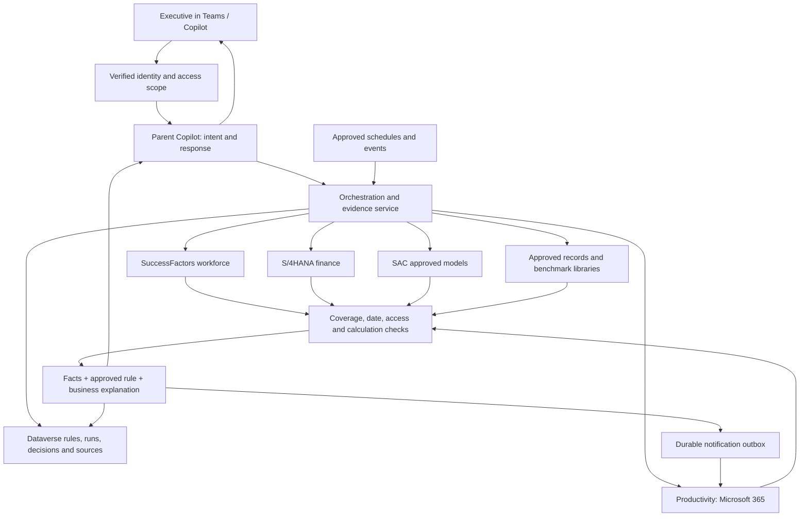

# AIATC capability implementation approach — Velora Executive Copilot

Prepared 5 September 2026. Scope: all nine capability rows and all six columns in “Capability Tracker _ AIATC Mandate - 02Sep.xlsx”, sheet “Capability Tracker”, rows 2–10; current working-tree code, including uncommitted changes. This is an implementation design and code assessment, not a production acceptance certificate.

## 1. Recommendation and scope

Keep the Executive Copilot as the single user experience. Retain the separate SuccessFactors, S/4HANA and SAC data services. Complete the Productivity integration and introduce a small, durable orchestration service for schedules, governed agent instances, recommendations, evaluations, and evidence. Store business configuration and execution records in Dataverse. Keep source documents in an approved document library with their original access controls.

The current code provides useful workforce calculations, finance query contracts, consent, disclosure controls, audit clients, cards and write-preview contracts. It does **not** establish that all nine capabilities are working end to end. In particular, the Productivity implementation uses sample records and simulated writes, Facilitator uses prepared meeting/briefing examples and memory held only in a running process, and the repository does not contain a working general recommendation scheduler, proposal evaluation service or peer comparison service. The tracker's statements about live tenant flows and historic runs need verification against tenant exports and actual run records; they cannot be certified from local code.

Deliver three things together: dependable source integrations; configurable, repeatable business logic; and evidence of what actually happened. A polished card alone is not completion. Each capability needs a success journey, unavailable-data journey, access-denied journey, restart/retry journey, and exportable acceptance evidence.

No live Dataverse schema changes or production Copilot publication are included in this planning task. The SuccessFactors container is built separately as requested; its exact build and verification status is recorded in `container-release.md`. The tracker is requirements material, not authorization to contact its named people, send emails, or change tenant policy.

## 2. Code findings and their business meaning

Locations below are relative to `/Users/vikrambala/copilotstudio`. The accompanying code inventory records symbol locations and file hashes across the five relevant Python services and deployment scripts. Inventoried/parsed files are not a claim that every unrelated Copilot Studio Kit component has been functionally tested.

| Finding | Source in this codebase | Meaning and required response |
|---|---|---|
| Workforce aggregation, paging, nationality reconciliation, disclosure filtering and cards exist | `mcp-apps/ask-successfactors/successfactors_mcp/successfactors_client.py`, `policy_engine.py`, `adaptive_cards.py`; `test/test_app.py`, `test/test_policy_and_drilldown.py` | Reuse these components. Reconcile results against a current authorized SAP report for the same company, date, population and filters. A mock test cannot prove production accuracy. |
| SuccessFactors uses a configured service account | `successfactors_client.py` access_context; `successfactors_settings.py` authorization_model; `ARCHITECTURE.md` identity decision | Do not tell users the query ran under their personal SAP role. Verify the signed-in user separately, enforce their company/domain scope, and explain the approved service connection honestly. |
| Consent wrapper covers only drilldown and memory | `successfactors_mcp/consent_gate.py`, `CONSENT_REQUIRED_TOOLS` | Some other tools expose employee records. Inventory every registered read tool, gate all personal-data paths, and remove redundant raw tools from executive exposure. Agent instructions alone do not enforce consent. |
| Admin routes supply a fixed admin role; identity fields can come from request arguments | `successfactors_mcp/successfactors_server.py`, `api_connections`, `api_connection_toggle`, `api_connection_rotate`; `policy_engine.py` | A caller with a shared API credential is not automatically an administrator. Enforce verified identity and role claims in a gateway and service; segregate admin routes from normal tools. |
| A configured target is compared with Emiratisation; it defaults to 40% | `successfactors_mcp/successfactors_settings.py`; `get_emiratisation_kpi` | This is a configured target, not proof of a UAE statutory requirement. Move approved targets, applicability and effective dates into versioned business configuration. Never label an unapproved default a legal standard. |
| Historical workforce calculations can combine historical jobs with current status | `get_emiratisation_kpi` warning when as_of_date is supplied | Historical comparisons need all inputs aligned to the requested date, or an explicit limitation and no definitive trend recommendation. |
| Finance generic query reads a bounded page and does not follow continuation links | `mcp-apps/ask-s4hana/s4hana_mcp/client.py`, `_request`, `query` | A page subtotal must not drive a full-company KPI. Implement complete paging or authoritative server aggregates; detect missing counts and repeated pages. Current quality confidence is hard-coded high even when sampled. |
| Finance display assumes AED and takes absolute balances in aging summaries | `s4hana_mcp/tools.py`, `build_text_summary` | Confirm currency and debit/credit conventions. Avoid adding different currencies or turning credits into receivables. Correct bucket labels: not-yet-due is different from 1–30 days overdue. |
| SAC has a real HTTP branch and an explicitly marked demo branch | `mcp-apps/ask-sac/sac_mcp/client.py` | Validate each configured API contract with the tenant. Presence of OAuth code does not prove that the KPI/model paths are supported by this tenant or produce reconciled data. Production must not silently fall back to demo. |
| Productivity mailbox, calendar, Teams and Planner reads are sample lists; writes edit those lists | `mcp-apps/ask-productivity/productivity_mcp/m365_client.py` | Replace with authenticated Microsoft Graph/approved connectors. “SENT”, generated IDs and constructed Outlook links currently do not prove a message was sent. Keep fixtures only in tests. |
| Productivity handoff loses source fields | `productivity_mcp/models.py`, `HandoffResponse`; `server.py` response construction vs `ReadToolEnvelope` | Preserve claim-level sources, freshness, warnings and coverage all the way back to the parent. Today a sourced child result can become an unsourced final answer. |
| Request time is used as source freshness | `productivity_mcp/tools_m365_reads.py`, `_create_read_envelope` | Distinguish “retrieved now” from “document/data last updated”. Old information must not appear current simply because it was read today. |
| Write approvals and duplicate detection use process memory; a fallback signing secret exists | `productivity_mcp/token_manager.py`; both Dataverse audit clients | A restart or second replica can defeat process-local replay protection. Use a required vault secret and durable conditional state transitions, bound to verified tenant and user. Do not broaden this into automatic sends. |
| Local buffering can still produce a success-shaped audit result | `successfactors_mcp/dataverse_audit.py`, `create_audit_record`; `background_logger.py`; Productivity audit service | Explicitly distinguish persisted, durably queued and failed. Memory buffering is not audit-ready evidence and can disappear on restart. Inspect live column mapping: rich fields can be embedded in audit detail instead of directly queryable columns. |
| Current recall is limited to 30 days and 100 retrieved logs | `successfactors_mcp/memory_service.py` | Useful recent conversation context, not permanent institutional memory. Add an approved records library, participants, source links, versions and long-term retrieval with access checks. |
| Facilitator calendar, brief facts, Loop exports and knowledge graph are prepared/in-memory | `mcp-apps/ask-facilitator/facilitator_mcp/tools.py` | Replace prepared facts and synthetic storage links. Do not certify historical retrieval, actual meeting join, or delivery from these functions. Its direct service-mailbox send path must be routed through governed delivery. |
| Facilitator REST handler references asyncio outside the scope where it is imported | `facilitator_mcp/server.py`, `handle_facilitator_tool_rest` | Fix the import and exercise every published REST route before relying on the meeting workflow. Authentication also needs explicit enforcement. |
| Schedule JSON is a catalog, not an executing scheduler | `ask-successfactors/automation/scheduled-prompts.json`, `trigger-payload.schema.json` | Build or export the actual triggers, worker, retries, delivery receipts and pause controls. An enabled JSON flag is not evidence that daily work ran. |
| Audit flow file is a design description; package builder includes three XML files | `deploy/solution/audit_cloud_flows.json`; `deploy/build_velora_executive_platform_solution.py` | Create real solution-aware Power Automate flows and export them through supported tooling. Verify import into a clean test environment, including connection references, roles, keys and flow activation. |
| No general lifecycle, recommendation or peer/evaluation runtime found in the five executive services | service tool inventories and searches; blueprint `CAPABILITIES.md` | Implement the missing services. The separate AgentReviewTool evaluates agents and is not a business proposal evaluation engine. Obtain tenant flow exports before duplicating anything already deployed. |
| Container omits an import-time OpenAPI dependency; package dependency list omits Pillow present in requirements.txt | SuccessFactors Dockerfile, server import and pyproject.toml | Fixed in this task: include required file, align chart dependency, include fonts, use non-root execution, add health check and exclude non-runtime build content. |

### Verification completed for this review

The final SuccessFactors image passed 83 existing unit tests and isolated process startup, authentication, packaged OpenAPI, MCP discovery and PNG chart checks. The test suite reported an async/logging cleanup warning at interpreter shutdown after its passing result. Tests used mocks/local fixtures and did not query live employee data.

The Productivity baseline ran 39 existing tests in an isolated container: 30 passed and 9 write-success assertions failed because operations returned FAIL_CLOSED_BLOCKED without live Dataverse credentials. This is not evidence that real writes were attempted or that fail-closed protection should be removed. Update test dependency injection to distinguish a mocked durable audit success from a real unconfigured audit store; then exercise the real integration separately. The current suite cannot be called fully green. Its sample-backed read tests do not prove Microsoft 365 connectivity. See `productivity-tests.log` and `successfactors-tests.log`.

The deployment template compiled successfully, and the ACR build/push succeeded. The 43-case acceptance matrix remains a planned UAT checklist; it has not been represented as an executed production test report.

## 3. Target flow and shared contracts

Every run carries tenant, verified caller, intended audience, capability, request/run ID, parent correlation ID, organization scope, requested period, source mode, policy version and time zone. Interactive runs derive identity from validated authentication, never from a model-supplied email or role. Background runs carry an approved service identity and a separately authorized recipient/scope. Recheck authorization before retrieving, disclosing, and delivering.

Use explicit result states: COMPLETE, PARTIAL, EMPTY, SOURCE_UNAVAILABLE, ACCESS_DENIED, NEEDS_CLARIFICATION, POLICY_BLOCKED, AUDIT_PENDING and ERROR. A missing source is never a zero. A suppressed workforce group is not an empty group. Mixed currencies or periods are not silently combined. Each source keeps its own outcome so one unavailable service does not hide valid results from another.

For each answer: authorize → record run start → get only required data → normalize and check completeness → perform versioned calculations → attach source evidence → explain → validate output → persist evidence → return/deliver → record outcome. On failure, return useful sourced partial information where allowed and clearly state which question could not be answered.

Keep the LLM responsible for interpreting a request and explaining approved facts. It must not invent thresholds, classify sample data as live, execute arbitrary query text, choose a recipient without resolution, calculate authoritative totals in prose, or mark its own recommendation approved.

## 4. Plain-language sources on every output

Use a shared “Sources and how this was worked out” component in chat, cards, email, digest, evaluation and exports. Include a compact source beside every material claim and an expandable detailed view; provide the same text inline when the channel cannot expand cards. Technical metadata remains in the auditor view, not the executive sentence.

For each source record retain: source ID; business name; what it contains; owner; environment; record/document/report link; source version; covered organization; covered dates; source updated time; retrieved time; measurement date; completeness; known limitations; permitted audience; and evidence snapshot/hash. Generated recommendations additionally reference an approved rule version. “SAP”, “AI analysis”, or “Dataverse” alone is insufficient.

Example wording below is illustrative, not a claim about live performance:

| Output | What the executive should see |
|---|---|
| Headcount | “Source: the approved employee register in SAP SuccessFactors. Counts active employees in the selected divisions as of 5 September. Read at 09:10 UAE time using the approved workforce connection. All requested records were included.” |
| Emiratisation | “Source: the employee register and recorded nationality. The percentage is UAE-national employees divided by the agreed eligible workforce. Employees whose nationality is missing are shown separately. Target: the HR-approved target record, effective for this period.” |
| Receivables | “Source: Finance’s open customer invoice report in SAP. Includes unpaid invoices for the selected company at the reporting date, in AED. Credit notes are treated according to Finance’s approved calculation.” |
| Recommendation | “Why this appeared: the overdue balance crossed the limit approved by Finance. Suggested next step: ask the collections owner to review the largest overdue accounts. Based on the invoice report and Finance’s alert rule; this is advice, not an approved action.” |
| Meeting action | “Source: the meeting transcript, 4 September, 14:22–14:48, and the organizer’s corrected minutes. Owner and due date were confirmed by the organizer.” |
| Historical answer | “Source: the approved decision record from 12 March, with the original minutes and supporting paper. These figures describe the position at that time. A later decision replaced part of this decision on 8 June.” |
| Peer comparison | “Source: the approved peer dataset, 2025 reporting year. Compares organizations in the agreed sector and size group. Two peers use a different reporting period, so they are excluded.” |
| Failed source | “The finance system could not be reached. The workforce section is available, but the combined finance/workforce comparison has not been calculated.” |

Expose a concise decision rationale: inputs used, rule applied, calculations, assumptions, alternatives where relevant, and limitations. Do not request or store a model's private chain-of-thought. This auditable explanation satisfies a reconstructable rationale without claiming access to hidden model reasoning.

Confidence is an evidence-quality label, not an invented probability. Proposed scheme: High = approved source, complete requested scope, current enough for this use, reconciled calculation; Medium = explicitly permitted limitation; Low = stale, incomplete or weakly comparable evidence; Not assessed = no valid basis. Low/unknown inputs must block definitive recommendations and scores. The weakest material input constrains the overall label. Record the reason in ordinary language, and keep model confidence separate if ever independently calibrated.

A source link must point to a real authorized item, not a constructed plausible URL. Where direct SAP links cannot be generated, use an authenticated evidence-detail page with report title, filters and source reference. The page must recheck access. Exports and citations must not reveal inaccessible document titles or individual employee rows.

## 5. Configurable Dataverse recommendation design

Use a model-driven “KPI and Recommendation Administration” app. Business owners should edit business fields—KPI, population, target, threshold, recommendation wording, schedule, owner and effective dates—without changing code. Do not put arbitrary Python, SQL, JavaScript or free-form executable expressions into a table.

Separate definitions, immutable published versions and run results. One flat table that overwrites thresholds would prevent historic reconstruction. The main configurable table is **KPI Recommendation Rule** (`cre2f_kpirecommendationrule`), linked to a KPI definition and source catalog.

| Table | Minimum fields and relationships |
|---|---|
| Source catalog (`cre2f_sourcecatalog`) | Business name/description, owner, environment, approved connection alias, permitted tool, evidence-link pattern, allowed scope, refresh expectation, sensitivity, approval/effective dates. No credentials. |
| KPI definition (`cre2f_kpidefinition`) | KPI code/name, business definition, source lookup, approved calculation code, unit, numerator/denominator definitions, company/division mapping, fiscal calendar, sign convention, completeness and freshness requirements. |
| KPI recommendation rule (`cre2f_kpirecommendationrule`) | Rule code/version, KPI lookup, organization scope, risk/opportunity/benchmark category, comparator, threshold/target/range, threshold unit, comparison window, minimum observations, consecutive breaches, clear condition, cooldown, severity, priority, recommendation template, explanation template, source/rule reference, owner, effective from/to, Draft/Approved/Active/Paused/Retired state, approver/date. |
| KPI snapshot (`cre2f_kpisnapshot`) | KPI/version, organization, period, value, unit/currency, coverage, source updated/retrieved times, source evidence lookup, validation state, input hash. Immutable for a completed run. |
| Recommendation (`cre2f_recommendation`) | Rule version, snapshot references, category, observed value, threshold, impact, explanation, suggested action, confidence reason, first/last detected, state, audience, duplicate key, root run ID. |
| Recommendation feedback (`cre2f_recommendationfeedback`) | Recommendation lookup, authenticated reviewer, useful/not useful, optional comment, recorded time. Unique reviewer/recommendation key; retain change history. |
| Run (`cre2f_capabilityrun`) | Capability, trigger, schedule instance, start/end, state, source outcomes, versions, snapshot IDs, cost/usage, error, evidence completeness, parent run, retry count. |
| Delivery (`cre2f_notificationdelivery`) | Recommendation/brief lookup, authorized audience, channel, scheduled time, attempt, external receipt/ID, submitted/delivered/failed/unknown state, reconciliation time, deduplication key. |
| Decision evidence (`cre2f_decisionevidence`) | Decision/run lookup, claim ID, source lookup/version, input snapshot, rationale, output hash, model/prompt/rule versions, verified identity, limitations, integrity manifest reference. |

Dataverse system ownership and role security apply. Configuration admins edit drafts; domain approvers publish their domain’s versions; runtime reads published rules and writes execution records; executives read only their permitted recommendations; auditors get a scoped read/export role. Feedback does not automatically alter a rule. Policy changes must not silently broaden source access.

Publication validation must reject missing approval/source, overlapping active rules at the same specificity, conflicting units, expired evidence, invalid windows, unsafe templates, unrecognized calculation codes and inaccessible company scopes. Resolve a specific organization rule before a global default; equal-priority conflicts are errors. Store effective versions on every run. Use Dataverse conditional updates and alternate keys for concurrent claims and configuration edits; see Microsoft’s [conditional operations](https://learn.microsoft.com/en-us/power-apps/developer/data-platform/webapi/perform-conditional-operations-using-web-api) and [alternate-key reference](https://learn.microsoft.com/en-us/power-apps/developer/data-platform/use-alternate-key-reference-record) documentation.

Start with the six tracker KPIs; targets below deliberately remain unfilled until approved:

| KPI | Source and calculation | Proposed configurable recommendation |
|---|---|---|
| Headcount | SuccessFactors; distinct eligible active employees, selected organization/date | Compare with approved staffing plan or approved change tolerance. Growth alone is not inherently good or bad. |
| Emiratisation | SuccessFactors; approved eligible population and recorded nationality | If below the effective HR target for the approved window, recommend reviewing the workforce plan. Unknown nationality and current/historical mismatch must affect quality. |
| Receivables | S/4HANA; complete open balances by due-date bucket and currency | If overdue exposure exceeds the Finance-approved amount/share, recommend a collections review. |
| Payables | S/4HANA; complete open supplier balances and due dates | If overdue or near-term obligations exceed the approved threshold, recommend payment-priority review; never automatically pay suppliers. |
| P&L | Approved S/4HANA statement or reconciled SAC model | Evaluate approved profit/margin thresholds with explicit ledger, fiscal period and currency. Confirm Finance sign conventions. |
| Budget variance | Approved actuals and budget version by mapped division | Compare actual minus budget using metric-specific favorable/unfavorable direction. Zero budget produces “no percentage comparison” plus amount variance. |

Recommended daily workflow: claim due rule/scope/window → freeze rule version → fetch required KPI once per authorized scope → validate source completeness → persist snapshot → evaluate deterministically → create/update recommendation → persist evidence → enqueue delivery → record channel result → capture feedback. Log successful scans with no breach as “no alert required”; never manufacture an alert to fill the 30-day record.

Deduplicate on tenant + audience/scope + metric + rule version + reporting window + breach episode. A continuing breach updates the existing item; a material escalation can notify again. Use a clear threshold/hysteresis to stop repeated open/close alerts. On source failure, create a data-availability event, not a favorable KPI result. Scheduled retries must not duplicate notifications. A pause must stop future dispatch, including queued work that has not yet been sent.

## 6. Complete implementation by tracker capability

### 6.1 Agent creation — tracker row 2

Implement a governed instance of an approved agent template: name, owner, natural-language task, schedule/event, permitted tools, data scope, destination, run budget, expiry and lifecycle state. The executive describes a task; Copilot extracts these fields, asks only for missing essentials, shows a readable preview and activates the instance after the executive confirms. No developer or IT ticket is needed for instances inside a previously approved boundary. New connectors or broadened access require separate platform governance.

Persist template and instance versions in `cre2f_agenttemplate` and `cre2f_agentinstance`. States: Draft → Validated → Active ↔ Paused → Retired; retain immutable run history. Edit creates a new version, validates it, and atomically changes the active version. Pause rechecks before tool execution and delivery; retirement disables schedules and revokes instance permissions, without deleting required evidence. Reject arbitrary executable code in the user request.

A template instance is not necessarily a new separately published Copilot Studio agent. David/PMO must confirm whether it meets AIATC’s acceptance definition. If a separate published agent is required, design and test the supported provisioning/ALM path and licensing before claiming compliance. The existing blueprint’s per-agent IT/security approval wording conflicts with the tracker's self-service intent; resolve it by pre-approving the boundary, with no new IT involvement for ordinary in-boundary creation.

Acceptance: demonstrate create, first scheduled run, edit schedule/task, pause before a due run, resume, retire, and denied out-of-scope creation. Export the executive request, confirmed specification, version, publication/activation result, identity and activity logs. Purview is a supplementary evidence source when access is provided.

### 6.2 Briefing synthesis — tracker row 3

Replace Productivity sample reads with real mailbox/calendar/Teams/Planner retrieval under validated authorization. Preserve original item links, last-modified dates, recurrence occurrence IDs, attendees, and cancellation state. Implement pagination, date filtering, time-zone conversion, rate-limit handling, attachment permissions and duplicate message handling.

For pre-meeting briefs: identify tomorrow’s authorized meetings at the agreed UAE local time → fetch relevant approved mail/files/prior decisions → optionally fetch required SAP facts → produce agenda, context, decisions needed, risks and questions → store with citations → attach or link according to organizer rights and agreed delivery policy → record actual result. Do not edit another organizer’s invitation merely because it appears on the executive’s calendar. Use a private brief link/email where attachment rights or participant visibility make modification unsuitable.

For end-of-day digest: read the local day’s actual activity, unresolved items and approvals from real supported sources → separate completed work from pending work → cite every material item → deliver within the approved window. Existing simulated “pending approvals” must be replaced with an actual approved source or omitted as unavailable.

Acceptance: late-created and rescheduled meetings, cancellations, daylight/time-zone boundaries, denied attachments, no meetings, partial source outage and duplicate triggers. Save sample pre-meeting and end-of-day outputs plus scheduled/generated/submitted/delivered timestamps. A provider accepting a request is not proof that an executive read it.

### 6.3 Decision traceability — tracker row 4

Implement a single run/evidence service used by all MCPs and flows. Record identity, purpose, permission decision, input references and hashes, source freshness, metric/rule versions, rationale, caveats, outcome, model/prompt version and approval/action linkage. Link every answer claim to its supporting evidence. Track original and superseding decisions explicitly.

Make decision evidence durable before presenting a recommendation as completed. Use a durable queue/outbox for asynchronous telemetry, a dead-letter queue and reconciliation worker. Return AUDIT_PENDING for durably queued evidence; never say “logged” merely because an in-memory enqueue succeeded. For externally visible writes, require persisted approval/operation claim before dispatch and retain unknown-delivery states until reconciled.

Proposed export: run ID, event time UTC and UAE display time, tenant/user, capability, request summary, source names/versions, source dates/scope, result, rule/calculation, rationale, quality/confidence reason, approval status, outcome, object link, hashes and integrity manifest. Store minimal permitted data; use restricted evidence snapshots when source values may change. A standalone hash does not guarantee tamper-proof storage: combine restricted access, audit history and independently retained/signed export manifests.

Publish this proposed schema now; map ADAA’s official fields when supplied. Integrate Purview as a second source with its own delay and completeness state. Its absence does not erase local logs, but can prevent final required evidence acceptance. Verify the sample period by reconciling request starts, terminal outcomes, decisions and delivery receipts.

### 6.4 Enterprise data query — tracker row 5

Keep the six query interfaces, but add a source/metric registry and organization mapping. Route only to allowlisted tools. “YTD spend vs budget by division” needs agreed fiscal year, entity, currency, actuals definition, approved budget version and a valid division mapping; it is not solved merely by calling multiple APIs.

Complete S/4 paging/server aggregates, source-supported period filters, sign/currency handling and tenant endpoint verification. Reconcile headcount/Emiratisation with HR, receivables/payables/P&L/budget with Finance, and SAC results against an approved model export. Keep endpoint availability distinct from metric correctness. Validate TLS, private DNS, firewall routes and credential rotation from the actual Container Apps environment.

For a cross-system ratio, retrieve aligned numerator and denominator, join only through approved organization/date mapping, record both sources, check zero denominator and quality, calculate outside the model, then explain. A partial answer can show available source sections; it must not produce a combined ratio when a material input is missing.

Acceptance: six reconciled live query outputs; mixed-currency, multi-page, empty, denied, stale and network-outage tests; a sourced cross-system example; connected-system inventory; verified user/service identity matrix; actual read logs. Production approval recorded in the tracker remains a stakeholder statement until current configuration and source-owner sign-off are attached.

### 6.5 Institutional memory — tracker row 6

Retain 30-day conversational recall for convenience, but create a separate approved institutional records library. Store document originals in SharePoint or another approved repository and searchable metadata in `cre2f_memoryrecord`: record type, title, date, participants, owner, summary, decisions, actions, original item/version, ACL reference, retention label, classification and supersession link.

Ingest only approved meetings, decisions, emails and documents. Process created/changed/deleted events with durable checkpoints and idempotent source-version keys. Use permission-aware retrieval and recheck source access before returning content. A successor receives only records explicitly assigned to the role; private mailbox history does not automatically become organization memory. Deletions/retention expiry propagate to search indexes and cached extracts; legal hold behavior must follow approved records policy.

Retrieval flow: verified question/scope → authorized candidates → relevance selection → source access recheck → original context and participants → distinguish historical facts from current facts → cite original documents and record retrieval. Do not fall back to unrelated memories and present them as a match. If a source has been deleted or replaced, disclose the state.

Acceptance: a record older than 30 days, a superseded decision, cross-user denial, successor-authorized access, revoked source access, deletion propagation, duplicate ingestion and restart recovery. Record which historical evidence was used in the resulting explanation.

### 6.6 Meeting intelligence — tracker row 7

Use Teams transcript/approved minutes ingestion as the first complete path; the tracker's evidence allows recorded minutes. The inspected Facilitator code does not prove a meeting-joining bot exists. If joining live or non-Teams meetings remains mandatory, implement it as a separate workstream with the correct meeting bot/media architecture and privacy approval, rather than claiming transcript retrieval equals live attendance.

Flow: meeting event → authorized transcript availability → fetch speaker/timestamp content → produce proposed minutes, decisions and actions → organizer reviews ambiguity → resolve named owners and explicit due dates → store approved minutes → create approved Planner tasks through Productivity → record real task IDs → reminders until completion/cancellation. Unknown owner/date stays “needs confirmation”; never invent it. Use transcript segment citations for actions and decisions.

Maintain `cre2f_meetingrecord` and `cre2f_meetingaction`, with transcript version and Planner synchronization version. Use task update checks to handle concurrent edits, changed due dates and deleted tasks. Reminder policy must be approved once for the standing workflow, scoped to named recipients, include cooldown/quiet hours, and stop on completion or revocation. Inbound meeting content cannot override permissions or send instructions.

Microsoft describes transcript retrieval and authorization choices in its [Teams transcript documentation](https://learn.microsoft.com/en-us/microsoftteams/platform/graph-api/meeting-transcripts/overview-transcripts). Validate the specific delegated, organization-wide or meeting-specific permission route in this tenant.

Acceptance: real meeting/approved minutes → sourced recap → confirmed decisions/owners/dates → real tasks → one due reminder → completion stops further reminders → record library retrieval. Test transcript unavailable, participant restriction, duplicate event, corrected minutes and non-Teams “not supported” response.

### 6.7 Proactive recommendation engine — tracker row 8

Implement the Dataverse design in section 5 and an actual scheduled worker/flow. Start with the agreed six KPI definitions and approved thresholds. Add an executive alerts feed with risk/opportunity/benchmark labels, source/why panel, status, acknowledgement and useful/not-useful feedback. A notification can link to the secured record rather than copying sensitive figures into a broad channel.

Scheduled work needs a supported background authentication route. Do not assume an absent user’s interactive token can be reused. Copilot Studio event triggers use the maker’s connection credentials; separate this from the target executive’s authorized data scope and approved delivery mandate. See [Microsoft’s event-trigger documentation](https://learn.microsoft.com/en-us/microsoft-copilot-studio/authoring-triggers-about).

Collect genuine 30-day recommendation/scan records with category, rule, source, explanation, quality, recipient, delivery outcome and feedback. Record days with no alerts and failed scans. Do not backdate fabricated runs or use test repeats as 30 days of production evidence. Existing tenant logs, if supplied and validated, can contribute to the period.

External signals are a later extension with approved source, owner, freshness, licensing and relevance criteria. Do not enable broad unsourced media monitoring as part of the initial six-KPI launch.

### 6.8 Evaluation engine — tracker row 9

Build a business evaluation service distinct from employee disclosure rules and the repository’s agent-quality evaluator. Add `cre2f_evaluationrubric`, `cre2f_evaluationcriterion`, `cre2f_evaluationcase` and `cre2f_evaluationresult`. Store approved criteria/weights, scoring scales, required evidence, fiscal assumptions, benchmark/precedent eligibility, effective versions and approval history.

Flow: receive authorized proposal/document → extract facts with page/section references → validate missing inputs → select approved rubric → retrieve authorized relevant precedents and approved benchmark inputs → calculate criterion scores/financial scenarios → generate explanation → persist immutable result and evidence. Output always includes alignment score, financial impact, comparable cases or “none available”, risks, open questions, sources, rubric version and limitations.

Example scoring contract: approved weights sum to 100; criterion grades map to a fixed 0–5 scale with anchors; normalized total = sum(weight × grade / 5). This is a proposed method for business approval, not an existing approved rubric. Required missing evidence yields INCOMPLETE; do not silently redistribute weights. For financial impact show cash timing, capex/opex, currency, recurring vs one-off, assumptions and sensitivity; compute NPV/payback only when inputs and discount rate are approved.

Replay means the same extracted facts, rubric/version and evidence snapshots reproduce the same calculation. LLM fact extraction itself can vary; persist and validate extracted facts before scoring and compare repeat extraction against a labeled set. Model-generated prose need not be word-for-word identical. Never convert unsupported narrative into an authoritative financial score.

Acceptance: several distinct real/test-labeled proposal types; repeated evaluation of frozen cases; missing inputs; contradictory documents; no comparable cases; changed rubric; unauthorized attachment; adversarial instructions within a document. Keep actual usage records for the requested 30-day evidence period.

### 6.9 Peer benchmarking — tracker row 10

Build the schema and comparison machinery while awaiting ADAA inputs; keep production peer comparisons disabled. Add `cre2f_benchmarkdataset`, `cre2f_benchmarkobservation` and `cre2f_benchmarkcohort`. Store approved peers, metric definitions, year/period, source URL/document/version, license, geography/sector/size, unit/currency, normalization method, inclusion rules, reviewer and expiry.

Flow: internal KPI snapshot → approved cohort and compatible period → normalize only by approved methods → exclude incompatible observations → calculate comparison → provide per-point citations and methodology → record run. Return “approved benchmark data not available” when missing; do not substitute invented peers or a public number without approval.

For percentiles, define tie handling and ranking method in the published methodology. Show peer sample size, exclusions and comparability limits. A small or incomparable cohort may show individual approved values without claiming a percentile. Separate performance gaps from recommended actions and carry the evidence quality into both.

Acceptance: approved source list, one reproducible KPI comparison, every point sourced, mismatched periods/currencies excluded, small-group suppression, expired dataset denial and a scheduled repeat. David/ADAA must supply the peers, metrics, source data and required output format; this is a genuine acceptance dependency.

## 7. Reliability, identity and operational controls

Implement one durable run state machine: Pending → Claimed → Running → Completed / Partial / Failed / Cancelled. Claims have lease expiry and conditional updates. Each source call has its own child run and retry policy. Retry safe reads on transient errors with bounded backoff and rate-limit handling. Do not retry unsafe external writes blindly after timeouts.

For writes/delivery use Prepared → Approved → Claimed → Submitted → Confirmed / Failed / Unknown. Bind approval to verified tenant/user, content checksum, destination, operation and expiry. Claim atomically in Dataverse before calling an external service. Use provider-supported idempotency where available; otherwise reconcile actual remote state before retry. An uncertain send remains Unknown and goes to review. Exactly-once delivery cannot be promised across independent systems merely by adding a local key.

Production must fail startup or disable the relevant capability when required credentials/configuration are missing; never activate an in-memory “production” store. Enforce network restrictions around admin APIs and authenticated MCP entry points. Partition caches by tenant, source environment, authorization scope, filters and effective policy. Re-evaluate policy before returning cached personal information. Prefer one replica initially for SuccessFactors until session, chart and cache behavior is proven across replicas; move transient chart storage to an authorized shared store for scale-out.

Health has three meanings: process alive, service ready for valid requests, upstream data connection operational. The existing `/health` is not evidence that SAP or Dataverse works; it can report healthy while connection configuration is incomplete. Configure Container Apps probes explicitly and record dependency health separately. Set concrete proposed acceptance targets for approval: 95% of interactive aggregate responses within 30 seconds or an honest progress/async response; 99% of due scans start within five minutes of their configured time; no duplicate external writes in retry tests; all completed recommendations have complete source evidence. These are proposed targets, not measured current performance.

## 8. Delivery order and work packages

| Package | Concrete code/flow work | Completion gate |
|---|---|---|
| A — establish truth and contract | Export actual tenant topics/flows; capture six source contracts; implement shared identity/source/result models; identify demo paths; establish UAT data | Agreed gap register, source owners and access matrix; no unmarked sample data in production path |
| B — reliable integrations | Complete Graph-backed Productivity, finance completeness/date/currency fixes, SF identity/consent coverage, SAC contract tests | Source-owner reconciliation and negative access tests for six KPIs and M365 actions |
| C — Dataverse foundation | Solution tables/roles/keys; rule administration UI; durable runs, snapshots, evidence and delivery outbox; migration of legacy audit mapping | Clean-environment import; restart/concurrency tests; export reconstructs a run |
| D — daily recommendations | Rule publication/validation; scheduler; deterministic evaluator; alerts feed, deduplication, feedback and delivery | Real scans, no-breach and failure paths; evidence collection begins |
| E — briefs, meetings and memory | Night-before/EOD workflows; transcript ingestion; approval/task/reminder flow; long-term record indexing | Full meeting-to-task-to-reminder-to-memory journey with sources |
| F — self-service agent lifecycle | Approved templates, natural-language instance creation, edits/pause/retire, schedule binding | Executive controls lifecycle without new IT ticket; PMO accepts definition |
| G — evaluation and benchmarking | Rubric/criteria admin, case ingestion/replay, source-linked results; peer import/normalization when approved inputs arrive | Multiple reproducible cases; approved benchmark sample; evidence logs |
| H — acceptance and rollout | Private-network UAT, production revision tests, security/source reviews, evidence export, operational handover | Named owners approve; required 30-day evidence and official format requirements satisfied |

Suggested planning range: 8–12 engineering weeks for the complete nine-capability program with overlapping work by an integration engineer, Power Platform engineer, backend engineer and QA/business analyst, assuming timely tenant access and source approvals. This is a rough planning estimate, not a delivery commitment. Validate it after package A. The 30-day observation window may overlap later engineering work but cannot be compressed into a single test day. Blocked peer inputs may extend final acceptance independently.

Keep the current service boundaries. Add a new `mcp-apps/executive-orchestration/` service for rules, runs and background work; package shared source/identity contracts in a versioned library consumed by all services. Extend Productivity rather than adding competing mail send paths. Keep `policy_engine.py` focused on disclosure; business scoring belongs in a separate module. Publish configuration schema through solution-aware ALM, not ad-hoc hand-crafted flow JSON.

## 9. Acceptance evidence and release gates

Use `acceptance-matrix.csv` as the working test checklist and preserve actual outcomes. Record environment, build digest, data/rule versions, expected/actual result, timestamps, source links, run IDs and reviewer. Screenshots supplement machine-readable receipts; neither mocks nor a green HTTP health page are sufficient live evidence.

Global gates: every numeric claim has a source and calculation definition; every recommendation has an approved rule/version; every historical claim identifies its original date; no sample input can enter production evidence; denied access never becomes an answer; partial data never becomes a complete total; retries/restarts do not duplicate external actions; paused/retired agents do no new work; evidence exports preserve tenant/row permissions; all published tools are exercised through the actual Copilot connector route.

AIATC pack: nine capability demonstrations; source-system/access inventory; sample decision export and field dictionary; actual automated delivery records; old-memory retrieval; meeting minutes/actions/reminder evidence; 30-day recommendation and evaluation usage logs; approved benchmark source list/sample; lifecycle creation/edit/pause/retire logs. Obtain ADAA format and peer inputs, PMO lifecycle interpretation, HR/Finance thresholds and rubrics, SAP endpoint/network sign-off, M365 transcript/delivery permissions, records retention approval and Purview access. Assign an owner and due date to each dependency without assuming the document author has already supplied it.

## 10. Sources and interpretation

Primary requirement source: [Capability Tracker _ AIATC Mandate - 02Sep.xlsx](</Users/vikrambala/Downloads/Capability Tracker _ AIATC Mandate - 02Sep.xlsx>), sole sheet, A1:F10. All row references in this report use that workbook. “Done” cells are stakeholder-reported status and are distinguished from locally verified implementation.

Primary implementation evidence: the code paths in section 2 and `code-inventory.csv`. Existing architecture/capability markdown describes intent; executable code and actual run evidence determine operational status. No current production SAP/M365 business read or email send was performed for this review.

Platform references used to validate the proposed implementation: [Container Apps managed-identity image pull](https://learn.microsoft.com/en-us/azure/container-apps/managed-identity-image-pull), [Container Apps health probes](https://learn.microsoft.com/en-us/azure/container-apps/health-probes), [Container Apps Key Vault secret references](https://learn.microsoft.com/en-us/azure/container-apps/manage-secrets), [Dataverse conditional operations](https://learn.microsoft.com/en-us/power-apps/developer/data-platform/webapi/perform-conditional-operations-using-web-api), [Dataverse alternate keys](https://learn.microsoft.com/en-us/power-apps/developer/data-platform/use-alternate-key-reference-record), [Teams transcript retrieval](https://learn.microsoft.com/en-us/microsoftteams/platform/graph-api/meeting-transcripts/overview-transcripts), and [Copilot Studio event triggers](https://learn.microsoft.com/en-us/microsoft-copilot-studio/authoring-triggers-about). These explain platform behavior; the architecture, delivery estimates, rules and acceptance criteria in this document are engineering proposals tailored to the inspected code.
