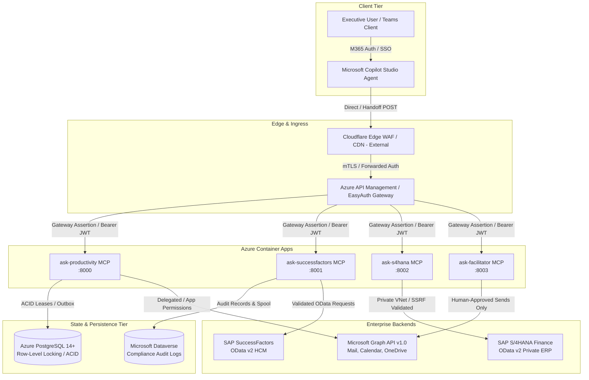

# Velora Platform - Architecture, Data-Flows, and Trust-Boundary Model (WP01)

Document Version: 2.1.0  
Baseline Security Review: 8 September 2026  
Status: Reviewable Engineering Artifact  

---

## 1. Executive Summary & Scope

This document defines the end-to-end architecture, data-flow inventory, identity trust boundaries, and threat model for the Velora Executive AI Platform. The platform provides conversational intelligence and governed operational assistance to senior leadership, integrating Microsoft Copilot Studio with enterprise backend services including SAP S/4HANA Finance, SuccessFactors HCM, SAC Analytics, and Microsoft 365 Graph / Dataverse.

### External Service Boundary Demarcation

> [!IMPORTANT]
> The following infrastructure and platform components lie outside the local application source boundary and remain **Open / External Dependencies** to be configured and attested by their respective platform owners:
> - **Cloudflare Edge**: WAF rules, DDoS mitigation, mTLS termination, and Cloudflare Access / Zero Trust policies.
> - **Quilr / MeshX**: Upstream partner data ingestion endpoints and network routing.
> - **Microsoft Entra ID**: Live tenant application registrations, client credential rotation, JWKS endpoint publication, and Conditional Access policies.
> - **SAP S/4HANA & SuccessFactors Production Tenants**: ERP user role bindings, private network peering (Azure ExpressRoute / VPN), and OData service configurations.

---

## 2. Component Topology & Architecture Diagram

---

## 3. End-to-End Data-Flow Register

The following register details all primary data flows across the system, documenting protocols, authentication mechanisms, identity bindings, data classification, and failure handling:

| Flow ID | Flow Name | Origin | Destination | Protocol / Port | Token Audience | Executing Identity | User Context Mechanism | Data Classification | Failure Mode / Behavior |
|---|---|---|---|---|---|---|---|---|---|
| **DF-01** | Executive Query & Handoff | Copilot Studio | `ask-productivity` (`/handoff`) | HTTPS / 443 | `https://mcp.velora.ae` | Managed Identity / EasyAuth | Bearer JWT (`oid`, `preferred_username`, `roles`) + Header Assertion | Confidential / Restricted | HTTP 401 on missing auth; HTTP 403 on body spoofing; fail-closed. |
| **DF-02** | Gateway MCP Tool Dispatch | API Gateway | All MCP Services (`/mcp`, `/tools/call`) | HTTPS / 443 | App ID URI | Gateway Service Principal | HMAC-SHA256 Gateway Assertion (`X-Velora-Gateway-*`) | Confidential | HTTP 401 on invalid signature; HTTP 409 on replayed nonce. |
| **DF-03** | Two-Step Write Preview & Claim | `ask-productivity` | PostgreSQL (`operations`) | TLS / 5432 | DB Auth (`DATABASE_URL`) | Service App Principal | Token `user_object_id` bound to payload SHA-256 checksum | Restricted | Lease contention returns HTTP 409; expired lease sets `OUTCOME_UNKNOWN`. |
| **DF-04** | Governed Email Dispatch | `ask-facilitator` | Microsoft Graph API | HTTPS / 443 | `https://graph.microsoft.com` | Service Principal / Client Credentials | Explicit Confirmation Token + Recipient Domain Policy | Confidential | Blocked without verified confirmation token (`APPROVAL_REQUIRED`). |
| **DF-05** | HCM Workforce Metric Query | `ask-successfactors` | SAP SuccessFactors | HTTPS / 443 | Basic / OAuth2 SAML Bearer | Service Account (`sf_username`) | Entra ID caller OID logged in Dataverse audit record | Confidential / PII | 5-minute TTL cache; upstream error returns safe masked summary. |
| **DF-06** | Audit Spool & Ingestion | `ask-successfactors` | Microsoft Dataverse | HTTPS / 443 | `https://*.dynamics.com` | Dataverse App Registration | Explicit `DataverseAuditRecord` with unique `(invocation_id, record_type)` | Audit Compliance | Durable local/volume spooling; fails closed on unspooled write. |
| **DF-07** | Financial Balance Inquiry | `ask-s4hana` | SAP S/4HANA Private API | HTTPS / 443 | SAP Client Credentials | S/4 Service Account | OData filter restricted; caller identity logged | Highly Confidential | P&L returns `UNSUPPORTED_OPERATION`; zero-balance/NaN returns `CONTRACT_MISMATCH`. |
| **DF-08** | SSRF-Protected Pagination | `ask-s4hana` | S/4HANA OData (`nextLink`) | HTTPS / 443 | SAP Client Credentials | S/4 Service Account | URL post-DNS validation against RFC 1918 / Cloud Metadata allowlist | Highly Confidential | Cross-origin, IP literal, or metadata redirect raises `SecurityException`. |

---

## 4. Trust Boundaries & Identity Binding Model

### 4.1 Boundary 1: Client to Gateway (EasyAuth / Entra ID)
- All client-facing traffic enters through Azure API Management / Container App Ingress.
- EasyAuth or API Gateway validates the incoming Microsoft Entra bearer token against `https://login.microsoftonline.com/{tenant_id}/v2.0`.
- Claims verified: `exp` (mandatory expiration), `nbf`, `iss` (exact match), `aud` (Velora Client Application ID), and `oid`.

### 4.2 Boundary 2: Gateway to MCP Microservices (Gateway Assertion)
- When backend services run behind an authenticated gateway, inter-service trust is asserted via signed gateway headers:
  - `X-Velora-Gateway-Signature`: HMAC-SHA256 signature covering canonical string:
    `f"{method}:{path}:{sha256(body)}:{timestamp}:{nonce}:{principal}:{tenant_id}:{object_id}:{roles}"`
  - `X-Velora-Gateway-Timestamp`: Unix timestamp (verified within ±300s window).
  - `X-Velora-Gateway-Nonce`: Cryptographically random UUID, verified against an atomic replay cache *only after* signature validation passes.
  - `X-Velora-Gateway-Principal`, `X-Velora-User-Oid`, `X-Velora-User-Roles`: Caller identity attributes.

### 4.3 Boundary 3: Model to Tool Execution (Human-in-the-Loop Gate)
- Read operations (`sf__get_headcount`, `get_calendar_meetings`) are governed by read-role authorization.
- Mutating operations (sending emails, modifying records, triggering external dispatches) require a two-step cryptographic approval pattern:
  1. **Prepare Phase**: The agent compiles the operation payload and calculates `sha256(payload)`. An `approval_id` and short-lived preview token are stored in `operations.db`.
  2. **Confirmation Phase**: The executive user reviews the preview and issues an explicit confirmation. The confirmation request must supply the verified `approval_id` and token, re-validating that caller OID matches the preparing OID.
  3. **Execution Phase**: The tool verifies the payload hash against the prepared hash and acquires an atomic database execution lease before dispatching to upstream APIs.

---

## 5. Comprehensive Threat Model & Abuse Cases

The following abuse cases reflect the threat analysis conducted during the 8 September 2026 security review:

### Threat 1: Executive Identity Forgery & Body Spoofing on `/handoff`
- **Threat Scenario**: An authenticated non-executive user sends a crafted request to `/handoff`, specifying an executive's email and `userObjectId` in the JSON body to access confidential executive briefings.
- **Root Cause**: Reading user identity from JSON body fields rather than cryptographic token claims.
- **Mitigation Implemented**: `verify_body_identity_binding` strictly validates that body `userObjectId` and `userEmail` match the verified token claims (`oid`, `preferred_username`). Discrepancies immediately reject the request with HTTP 403 Forbidden.

### Threat 2: Nonce Replay & Gateway Assertion Forgery
- **Threat Scenario**: An attacker intercepts a signed gateway assertion header and replays it against a different endpoint or with a modified payload.
- **Mitigation Implemented**: 
  - Canonical signature explicitly binds HTTP `method`, `path`, and `SHA-256(body)`. A signature for `GET /health` cannot be reused for `POST /handoff`.
  - Nonce checking is performed strictly *after* cryptographic HMAC validation, preventing denial-of-service exhaustion of the nonce cache by unauthenticated callers.

### Threat 3: Server-Side Request Forgery (SSRF) via OData `nextLink`
- **Threat Scenario**: A malicious or compromised SAP endpoint returns an `@odata.nextLink` pointing to the Azure Instance Metadata Service (`http://169.254.169.254/metadata/identity/oauth2/token`) to steal container managed identity tokens.
- **Mitigation Implemented**: `SSRFValidator` resolves destination DNS hostnames and verifies resolved IP addresses against blocked ranges (`169.254.0.0/16`, `168.63.129.16/32`, loopback `127.0.0.0/8`, and unapproved RFC 1918 subnets). Redirect following is strictly validated on every hop.

### Threat 4: Prompt Injection leading to Unapproved Email Dispatch
- **Threat Scenario**: An external meeting invite contains prompt injection payloads attempting to trigger `send_executive_email_via_graph` to external attacker addresses.
- **Mitigation Implemented**:
  - `FACILITATOR_AUTO_SEND_GUIDE` and tool handlers strictly mandate executive preview and human confirmation (`require_confirmation=True`).
  - `validate_recipient_policy` blocks email dispatch to any recipient domain outside the approved enterprise whitelist (`velora.ae`, `etihadairp.ae`, `microsoft.com`).
  - Strict HTML escaping (`html.escape`) is applied to all meeting topics, attendees, and action items, neutralizing script and tag injection.

### Threat 5: Audit Log Tampering & Unaudiited Governed Execution
- **Threat Scenario**: An attacker induces transient Dataverse network failures to execute governed financial operations without leaving a compliance audit trail.
- **Mitigation Implemented**: Governed operations enforce synchronous audit spooling before execution. When Dataverse is unreachable, events are written to durable local spooling (`sf_audit_spool.jsonl`). Spool eviction is strictly prohibited on uncommitted (`BUFFERED`) states.

### Threat 6: Race Conditions and Double-Send in Multi-Replica Deployments
- **Threat Scenario**: Two horizontally scaled container replicas simultaneously process the same scheduled executive notification, resulting in duplicate emails.
- **Mitigation Implemented**: Atomic lease acquisition with optimistic locking (`WHERE version = :version AND (state = 'PENDING' OR lease_expiry < :now)`). When an execution lease expires during an active network call, the state transitions to `OUTCOME_UNKNOWN` rather than blind duplicate re-execution, requiring reconciliation.
