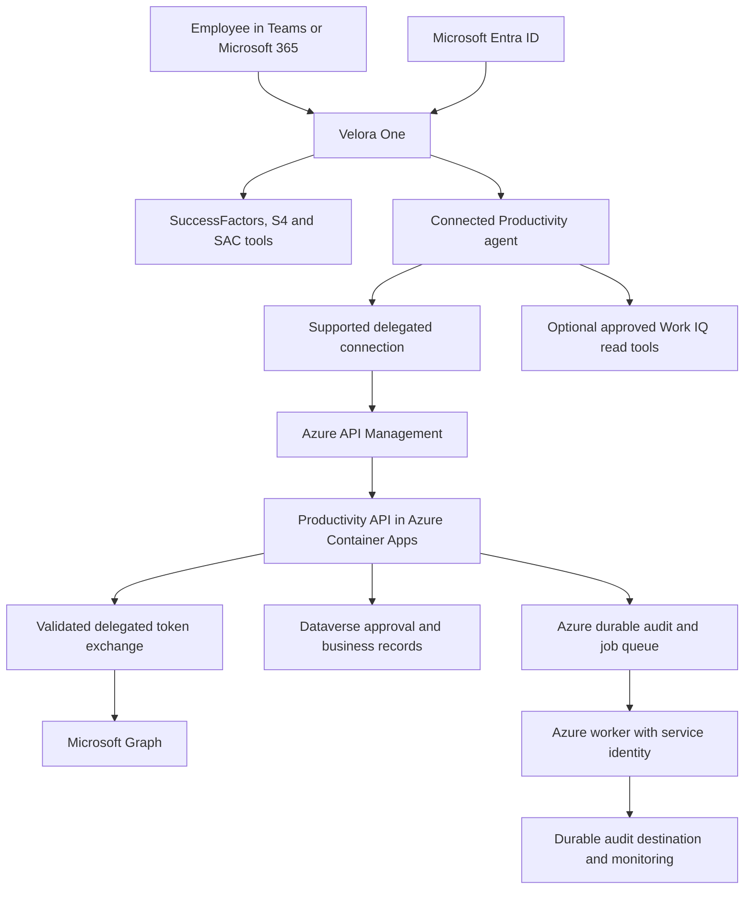

# Velora One — implementation proposal using the requested Entra setup

Date: 7 September 2026. Status: proposed design and implementation handover; no tenant changes, deployment or application implementation performed for this proposal.

## Recommendation

Retain the Entra app registration and administrator-consent work already requested. Use them as the foundation for a verified delegated-user connection to a governed Productivity API, owned by the connected Productivity agent. Keep SAP tools with Velora One. Use separate service identities for durable audit ingestion and explicitly authorized background jobs.

The email already sent can remain the identity-enablement request. The implementation team should attach a scope and configuration addendum rather than treat the email as proof of completed end-to-end authentication. Application IDs, consent grants and connection bindings must be verified before release.

Success means a user can ask for a day plan or urgent mail, receive authorized live results with clear sources, and approve an action that executes once and is durably audited. Routine repeat sign-in should be minimized where the selected connector/channel supports it. Initial connection authorization, Conditional Access challenges, revocation and expiry can still require user action; zero prompts under every circumstance is not an acceptance promise.

## 1. What we retain from the IT request

| Requested component | Proposed use | Verification needed |
|---|---|---|
| Velora-One-Copilot-SSO app | Agent/channel sign-in and, where correctly configured, the custom API's delegated authorization boundary | Tenant, client ID, credential ownership, redirect URIs and supported channel |
| access_as_user scope | Authorize calls to the protected Velora API | Correct token audience; API must validate signature, issuer, tenant, expiry and scope |
| Graph delegated grants | Enable only the approved operations executed under the user's identity | Grants belong to the actual token-requesting application; consent does not create a connector connection |
| Teams preauthorization | Support the documented Teams SSO flow | Correct client IDs, actual Teams channel App ID and resource URI |
| Dynamics CRM consent | Retain if an actual delegated Dataverse scenario needs it | Do not assume it is required for central service-written audit |
| Tenant administrator consent | Reduce per-user permission-consent requirements for the relevant app | Actual grants, service principal, user assignment and Conditional Access |

Do not blindly activate every write permission in the earlier matrix. Document the operation requiring each grant. If grants already exist, review their use with IT; this proposal does not revoke any permission automatically.

The documented Teams clients are 1fec8e78-bce4-4aaf-ab1b-5451cc387264 for mobile/desktop and 5e3ce6c0-2b1f-4285-8d4b-75ee78787346 for web. Verify the supplied bot/channel identifier before constructing api://botid-{id}. Additional client preauthorizations need a documented host requirement. [Microsoft Teams SSO setup](https://learn.microsoft.com/en-us/microsoft-copilot-studio/configure-sso-teams).

## 2. Target architecture

The optional Work IQ path is for an explicitly assigned capability with a proven connection, such as document discovery. It must not create a competing route for the same write operation. Microsoft-managed Work IQ, Copilot Studio, Graph and Dataverse remain managed cloud services; custom code and jobs run in Azure, with their images stored in ACR.

### Responsibility boundaries

- **Velora One:** conversation, SAP queries, cross-system synthesis, presenting approval previews and returning the final answer.
- **Productivity agent:** Microsoft 365 intent resolution, selection of the single approved provider route, preparation of results and requests for missing context.
- **Productivity API:** trusted identity enforcement, source access, deterministic validation, preview integrity, authorization, duplicate control and truthful provider outcomes.
- **Facilitator:** meeting-content processing only where implemented with real sources. It does not bypass the Productivity write path.
- **Audit worker:** durable ingestion/reconciliation under its own limited service identity, with the requesting user preserved as an audit attribute.

The source currently labels an OpenAPI /handoff service as a connected agent. Establish an actual Copilot Studio connected-agent relationship separately. An HTTP handler is not itself another agent's orchestration context.

## 3. First milestone: prove the authentication path

Before expanding permissions or rebuilding every flow, deliver one vertical slice: Teams user -> Velora One -> Productivity -> protected API -> user's Microsoft Graph mailbox read.

1. Export current agents/connections and record the actual runtime experience and channel. Repository Teams/declarative-agent packages are not an authoritative export of live Copilot Studio registrations.
2. Verify the existing SSO app, channel app ID, scope, token-exchange settings and applicable Microsoft client preauthorizations.
3. Establish a supported end-user/OBO connection for the custom API. Verify the chosen connector/experience actually supports the intended exchange; do not invent a token-sharing mechanism.
4. Validate a token intended for the API. Derive the user from validated tenant and object-ID claims. Do not accept an arbitrary userEmail request field as authority.
5. Use a supported Microsoft authentication library to obtain a delegated downstream Graph token, where OBO is the chosen flow. Never forward an API-audience token directly to Graph.
6. Read the signed-in user's permitted mail through that identity, without sending, editing or deleting anything.
7. Repeat with a second user and an attempted cross-user mailbox reference. The unauthorized cross-user request must be rejected.
8. Repeat in the evaluation user-profile context. Do not assume a successful Teams session configures evaluation credentials.

**Exit gate:** the team captures the route, principal identity, granted scopes, correct mailbox result and durable audit correlation without exposing tokens. If custom OBO is unsupported in the actual host/connector combination, use supported user connections for the assigned operations and an explicit onboarding step. Do not fall back to broad application access just to suppress prompts.

Microsoft documents OBO settings for some connections, and distinguishes initial sign-in from administrator consent. This is conditional support, not a universal promise. [Connection configuration](https://learn.microsoft.com/en-us/microsoft-copilot-studio/authoring-connections). The backend exchange must follow the identity platform's audience and delegated-token requirements. [OBO protocol](https://learn.microsoft.com/en-us/entra/identity-platform/v2-oauth2-on-behalf-of-flow).

## 4. Backend authentication changes

The latest reviewed Productivity client accepts AZURE_*, M365_* and ENTRA_* configuration names. That earlier mismatch is improved. However, its token method still uses client_credentials with Graph .default, and its new authorization probe calls a chosen mailbox using that same token. A successful application-token read proves the app can read the mailbox, not that the requesting person is entitled to it.

Required implementation:

- Separate delegated-user and service-only clients. Personal interactive operations must not silently select the service-only client.
- Remove a global environment Graph token as the identity source for multiple users.
- Partition authentication caches by tenant, user, resource and client identity. Use supported secure cache handling in Azure; no bearer tokens in prompts, tool arguments, logs or ordinary Dataverse rows.
- Resolve the effective user from verified identity at the API boundary. Allow access to another mailbox only through an explicitly supported and authorized shared/delegated-mailbox flow.
- Enforce delegated scopes for the requested operation and actual source permissions.
- Propagate revoked sessions, missing consent and Conditional Access claims challenges as actionable connection states. Do not retry indefinitely or simulate a successful response.
- Keep the approved custom API reachable from Copilot Studio through a secured ingress path. If Container Apps ingress is private, configure the appropriate gateway/network connectivity; do not point a SaaS connector at an unreachable private URL.

For central audit writes, use a Dataverse application user with narrowly scoped table privileges. Log both the requesting person and the executing service. [Dataverse service authentication](https://learn.microsoft.com/en-us/power-apps/developer/data-platform/use-single-tenant-server-server-authentication).

## 5. Connection onboarding and recovery

Provide a capability-based connection check: Mail, Calendar, Teams, Tasks and Documents. Its states are Connected, Not connected, Expired/Reauthentication required, Access denied and Source unavailable. Do not collapse them into one generic connection-manager answer.

For an unconnected user, explain the affected capability and provide the supported connection action. After successful connection, resume the original request. For connected returning users, use the supported cached/SSO session. If one optional source fails, return the remaining verified sections and identify the missing source. Required-source failures block the dependent operation.

Do not expose test-only connection probes to production as proof of authorization. Checks must run with the same identity and endpoint semantics as the real operation.

Consent to disclose HR information, permission to connect a service and approval to send an email are distinct decisions. None substitutes for another.

## 6. Business flows for the failed evaluation cases

| Flow | Implementation | Required output |
|---|---|---|
| Plan my day | Resolve local day; retrieve calendar, due/overdue tasks and urgent mail; normalize timezones; deduplicate; calculate overlaps and usable gaps | Source-linked schedule and proposed priorities; no calendar changes |
| Draft reply to Ahmed | Resolve the person and relevant thread; ask a focused question if ambiguous; retrieve the thread and compose a response | Draft text tied to the correct thread; no send. Saving an Outlook draft is an explicit write operation |
| Quick-action checklist | Retrieve real tasks, flagged follow-ups and meeting commitments; separate confirmed tasks from inferred actions | Up to seven prioritized actions with source references and due dates where known |
| End-of-day wrap-up | Retrieve completed tasks, authorized decisions and unresolved items for the local day; distinguish verified achievements from inference | Draft summary with available-source coverage; approved delivery only if requested |

Use timezone-aware boundaries and handle empty results, paging, null fields, ambiguous people, inaccessible files and conflicting sources. Do not fabricate target IDs, deep links, approvals or business amounts.

S4 remains four report families: AR ageing, AP ageing, budget movements and budget consumption. P&L remains excluded. Finance-approved mapping and exact source-key defects from the review still need closure.

## 7. Governed write execution

Every personal email/calendar/task/message write uses a backend-enforced state machine:

PREPARED -> AWAITING_APPROVAL -> APPROVED -> EXECUTING -> SUCCEEDED / FAILED / OUTCOME_UNKNOWN.

Persist the preview, user/tenant, operation, destination, payload checksum, expiry, policy version and unique idempotency key before approval. A separate trusted approval action binds the user's confirmation to that stored preview; a model-supplied approvalRequired=false or approved=true is never sufficient.

Before execution, verify identity, approval, preview integrity and expiry; atomically claim the operation in a shared Azure/Dataverse store. A changed preview needs fresh approval. A duplicated call must find the existing result or active claim rather than execute again. Do not automatically replay an uncertain non-idempotent provider call.

Return the real provider reference. Distinguish acceptance from delivery/completion. A Graph request ID must not be fabricated into an Outlook item link. No alternative Facilitator/native-write tool should bypass this control for the same operation.

## 8. Azure runtime and detailed audit

| Component | Proposed location/control |
|---|---|
| Custom service images | ACR, independently versioned and deployed by tested digest |
| API services | Azure Container Apps with health/readiness, restricted ingress and resource limits |
| Gateway | Azure API Management where needed for reachability, JWT validation, throttling and correlation; backend also authorizes |
| Secrets/certificates | Azure Key Vault, accessed through managed identity where supported |
| Operational queues | Azure Service Bus or another approved Azure queue with durable ownership/retry; do not rely on process-local claims |
| Approval/rule/business state | Dataverse with real server-side keys and concurrency controls |
| Evidence objects | Approved Azure Blob storage, access-controlled and versioned as required |
| Monitoring | Azure Monitor/Application Insights and alerts for failed authentication, logging, queue backlogs and worker failures |

No production default should put durable state under /tmp, a home directory or unmounted container storage. Shared Azure Files can provide persistence where deliberately used, but does not by itself fix atomic claims or duplicate processing.

Audit events must contain a stable event ID; parent/child correlation; requesting tenant/user; executing identity; operation and safe scope; source and retrieval time; authorization/consent/approval decision; preview/rule/policy version; actual provider outcome; retry/reconciliation status; and safe source references. Never include credentials or unnecessary personal content.

An event is committed only when the durable sink acknowledges it. The existing worker's buffered-versus-persisted behavior needs correction. Restrict audit writes, reads and retention according to approved policy; no fabricated retention compliance claim.

## 9. Scheduled work is a separate authentication design

Do not assume Teams sign-in supplies a usable user token to a job the next morning.

Initial release: interactive briefings and draft generation, plus service-identity jobs for queue recovery and audit reconciliation. Add scheduled personal data access only after its supported delegated-session lifecycle or separately approved application-access model is proven for each API.

A personal schedule must store the user's explicit enrollment, data scope, timing/timezone and delivery policy. Revocation or an authentication challenge pauses the dependent job and creates an actionable notice. No silent switch to a maker's mailbox or broader identity is allowed.

Long-running delegated access has platform/library-specific prerequisites; offline_access is not a guarantee of perpetual access. Treat scheduled personal briefings as a separate release gate, not as a benefit automatically delivered by administrator consent.

## 10. Evaluation and CI/CD

Use a designated, authorized evaluation profile with the relevant license and established connections. Validate profile/connection health before the run. Microsoft supports loading an evaluation user's connections and supplying profile context in automated evaluations. [Evaluation profiles](https://learn.microsoft.com/en-us/microsoft-copilot-studio/analytics-agent-evaluation-results), [automated evaluation connection](https://learn.microsoft.com/en-us/microsoft-copilot-studio/analytics-agent-evaluation-automate-tools).

Separate outcomes:

- **Precondition blocked:** expired/missing connection, unavailable required source or insufficient permission. Do not count this as business success.
- **Functional pass/fail:** the actual source-backed task or expected clarification/approval behavior is correct/incorrect.
- **Response quality:** clarity, relevance and formatting, assessed independently.

Run the 15 existing questions with source-based expectations. Add multi-turn tests for ambiguity and approved writes. Keep controlled unit-test inputs outside runtime packages; no demo responses or synthetic seed records in production. End-to-end tests use authorized real connections and deliberately chosen records; no unapproved message sends or business mutations.

Required negative/recovery tests: user A cannot read user B; forged principal rejected; expired token/approval; missing scope; two consumers one action; crash after provider acceptance; audit outage and recovery; partial source outage; inaccessible document; no dummy fallback; immutable image/revision matching; rollback.

## 11. Delivery work packages

| Order | Owner | Deliverable | Exit gate |
|---|---|---|---|
| 1 | IT/Entra + Copilot maker | Inventory, verified app/channel IDs, scoped grants and connection model | Real delegated read succeeds through the actual channel and rejects cross-user access |
| 2 | Copilot maker | Published Productivity connected agent and one route per capability | Parent trace shows intended delegation; no competing direct write route |
| 3 | Backend team | Delegated auth, live reads, four business flows, truthful unavailable states | Source-backed acceptance and no production simulation |
| 4 | Backend + Dataverse team | Persistent approval/idempotency and audit state | Duplicate/crash/outage tests pass with durable evidence |
| 5 | Azure platform team | Complete image/release inventory, networking, identities, queues and monitoring | Tested digests deployed; runtime has no local durable dependency |
| 6 | QA + business owners | Connected evaluation profile, 15-case rerun and negative/recovery pack | Functional acceptance documented separately from language quality |
| 7 | Product owner + operations | Small user pilot, support process and controlled rollout | Correct isolation, stable operation and recoverable failures demonstrated |

Estimate delivery effort after the first authentication slice and source-contract review. The connector/OBO compatibility and remaining live implementations materially affect effort; there is no evidence for a reliable completion-date promise yet.

## 12. Required evidence and open decisions

IT evidence: actual app/tenant IDs; client preauthorizations; effective delegated grants; channel configuration; policies/licensing; approved test user. No secrets should be emailed or included in the proposal.

Engineering evidence: actual connected-agent registration; discovered tool contracts; delegated-token route; provider ownership matrix; deployed image digests; queue/state/audit configuration; runbook and rollback record.

Business decisions: which writes are enabled; scheduled personal briefing scope; approved recipients/sources; audit retention; Finance mapping; whether optional Work IQ read integrations add a required capability.

The reviewed repository still contains simulation/sample paths. The previous cleanup script was not applied, and the source has changed since its preview. Regenerate a reviewed cleanup plan against the current source; do not run an old hash-bound manifest or certify deletion. Rebuild packages/images after cleanup, and inventory persisted records separately before any targeted deletion.

## Acceptance statement

Approve production only when the user identity reaches the correct source, each business operation follows its intended route, unavailable sources produce truthful results, approval and duplicate controls are enforced by the backend, and the result can be traced to durable audit evidence. SSO configuration and administrator consent alone do not satisfy this statement.
