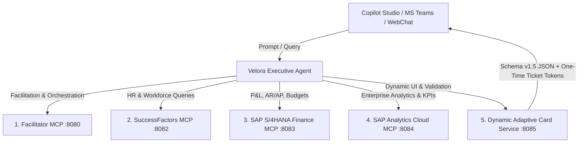

# Velora Copilot Studio & MCP Servers Suite

Enterprise-grade Model Context Protocol (MCP) servers and Dynamic Adaptive Card Rendering Engine for **Microsoft Copilot Studio** and **Velora Executive AI Agent**.

---

## 🏛️ Architecture & Services Overview



---

## 📦 Services in this Suite

| Service | Directory | Port | Description |
| :--- | :--- | :--- | :--- |
| **Dynamic Adaptive Card Service** | [`dynamic-adaptive-card-service/`](./dynamic-adaptive-card-service) | `8085` (`8080` container) | Sub-15ms hydration of dynamic Adaptive Cards (v1.5) with HMAC ticket tokens, XSS/URL sanitizers, and Markdown fallbacks. |
| **Facilitator MCP** | [`ask-facilitator/`](./ask-facilitator) | `8080` | Orchestration and context aggregation across enterprise tools. |
| **SuccessFactors MCP** | [`ask-successfactors/`](./ask-successfactors) | `8082` | SAP SuccessFactors HCM, Headcount, Org Structure, and Emiratisation analytics. |
| **SAP S/4HANA Finance MCP** | [`ask-s4hana/`](./ask-s4hana) | `8083` | Read-only SAP S/4HANA finance tools (P&L, AR/AP aging, budget variance). |
| **SAP Analytics Cloud (SAC) MCP** | [`ask-sac/`](./ask-sac) | `8084` | SAP Analytics Cloud metrics, story widgets, and enterprise forecasts. |

---

## 🚀 Quick Start (Local Development)

Run the entire 5-service cluster with Docker Compose:

```bash
# Start all 5 MCP servers
docker-compose up -d --build

# Verify services
curl http://localhost:8080/health  # Facilitator
curl http://localhost:8082/health  # SuccessFactors
curl http://localhost:8083/health  # S/4HANA Finance
curl http://localhost:8084/health  # SAC Analytics
curl http://localhost:8085/health  # Adaptive Card Service
```

---

## ☁️ Deploy to Azure Container Apps

### 1. Build and Push All Docker Images
```bash
./build_all_images.sh <your_acr_name>.azurecr.io
```

### 2. Deploy Cluster
```bash
export ACR_NAME=<your_acr_name>
export RESOURCE_GROUP=rg-copilot-studio-mcp
export LOCATION=eastus

./deploy-azure-containerapps.sh
```

---

## 🛡️ Security, Reliability & Compliance

- **Universal Schema v1.5**: Targeted at Schema v1.5 to guarantee seamless rendering across Microsoft Teams (Desktop & Mobile) and Bot Framework Web Chat without crashes.
- **Single-Click Idempotency**: All interactive cards contain cryptographic `ticketToken`s to eliminate duplicate submissions from old cards in chat history.
- **Payload Budget**: Strict 15KB payload limits prevent hitting Teams' 28KB activity ceiling.
- **Enterprise Isolation**: Anonymous authentication enabled for internal container app ingress, permission-trimmed at SAP source under executive delegated identity.
