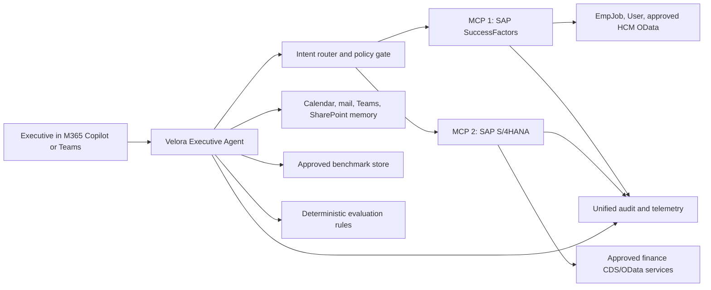

# Two-MCP architecture

## Logical topology

## Server boundaries

| Boundary | SuccessFactors MCP | S/4HANA MCP |
|---|---|---|
| Purpose | Workforce and Emiratisation | Finance and controlling |
| Approved queries | Headcount, Emiratisation | Receivables, payables, P&L, budget variance |
| Authorization | SuccessFactors RBP | S/4HANA PFCG/CDS authorization |
| Initial mode | Read-only | Read-only |
| Default data class | Confidential workforce data | Confidential financial data |
| Tool prefix | `sf__` | `s4__` |
| Deployment | Independent hostname, secret, scaling, and logs | Independent hostname, secret, scaling, and logs |

The servers must remain separately deployable. They must not share SAP credentials, API keys, caches, or unrestricted logs.

## Request sequence

1. Microsoft 365 authenticates the user and invokes the agent.
2. The policy gate records purpose, user context, capability, and correlation ID.
3. The router selects SuccessFactors, S/4HANA, or both.
4. Each MCP server authenticates the caller and applies its SAP authorization model.
5. The MCP server calls only an allowlisted SAP service and returns a normalized envelope.
6. The evaluation engine performs versioned calculations when targets or thresholds apply.
7. The agent synthesizes the answer with source, freshness, confidence, and caveats.
8. The audit service records safe metadata and a response hash.

## Identity decision

The target shown in the capability slides is the executive's own SAP authorization context. The existing SuccessFactors implementation uses a configured service account. Before production, choose and approve one model for each server:

- **Delegated/on-behalf-of identity:** preferred when SAP and the MCP gateway support reliable user-token exchange and role mapping.
- **Service identity with policy enforcement:** acceptable only when access is narrowly scoped, user authorization is enforced before the SAP call, and the residual risk is approved.

Never describe service-account results as executed under the executive's own SAP role.

## Routing rules

| User intent | Route |
|---|---|
| Headcount, positions, organization, Emiratisation | SuccessFactors MCP |
| Customers owing money, overdue receivables, revenue | S/4HANA MCP |
| Supplier liabilities and upcoming payments | S/4HANA MCP |
| Revenue, cost, margin, P&L | S/4HANA MCP |
| Budget versus actual | S/4HANA MCP |
| Revenue per employee or workforce-cost explanation | Both; preserve two source citations |
| Brief, meeting, memory, benchmark, or agent lifecycle | Platform service first; call SAP only for required live facts |

## Reliability rules

- Use explicit connection and total timeouts.
- Retry only idempotent reads, with exponential backoff and jitter.
- Propagate rate-limit and partial-result states instead of fabricating an answer.
- Cache only approved aggregates and include their as-of time.
- Keep one server failure from hiding valid results from the other server.
- Use idempotency keys for notifications, task creation, and other write workflows.
